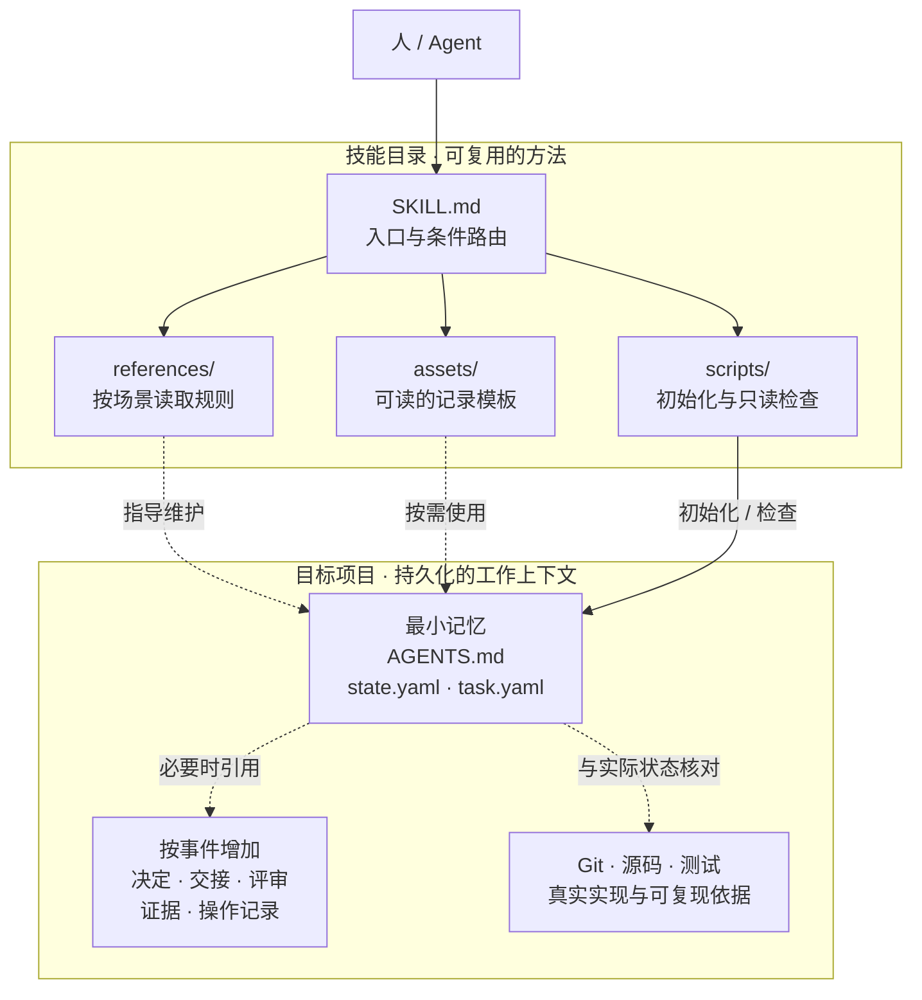
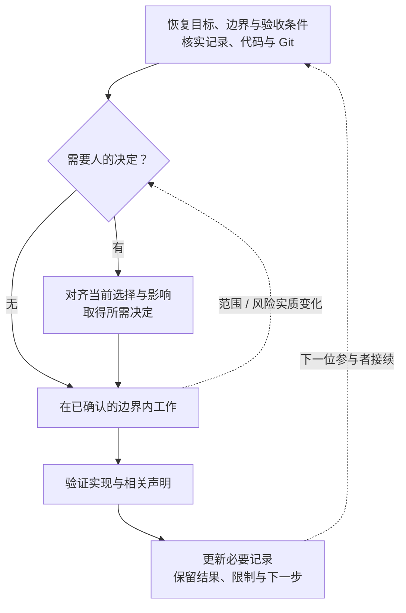

# Managing Vibe Project Memory

**把项目上下文留在仓库里，让下一位 Agent 接得上。**

用最少必要的持久化记录，保存目标、边界与决策，支持跨会话、跨 Agent 的连续工作。

- **仓库即记忆**：普通任务从 3 个项目文件开始，不必重放全部聊天。
- **按风险加深**：需要时再启用交接、评审、视觉对齐与高影响操作记录。
- **宿主无关**：协议与模板直接可读；Python 脚本提供可选的初始化和检查能力。

[快速开始](#quickstart) · [架构设计](#architecture) · [应用场景](#scenarios) · [命令与模板](#commands) · [参与贡献](#contributing) · [常见问题](#faq)

> 当前支持 schema 3 / protocol 3.0。无需构建、后台服务或第三方 Python 依赖。仓库尚未指定许可证，使用与分发前请留意[许可说明](#license)。

<a id="capabilities"></a>

## 为什么需要它

代码能告诉下一位 Agent「实现了什么」，却未必能解释「为什么这样做」「哪些地方不能动」「还有什么没确认」。

例如，你今天让 Agent 修复登录表单，并明确说「只修输入校验，不改登录流程」。明天换了会话：

- 没有持久化边界，新 Agent 可能重新猜测目标，甚至顺手重构登录流程。
- 有了项目记忆，它先找到当前任务，读到范围、非目标与验收条件，再检查真实代码和 Git 状态。
- 如果今天还留下了无法从仓库推导的调查线索，交接记录补上这部分信息；已有记录足够时，不额外写一份总结。

这项技能把连续工作拆成两件事：**Agent 维护有用的上下文，工具检查可机械验证的约束。** 它不承诺消除模型误判，也不把「记录完整」等同于「工作完成」。

<a id="quickstart"></a>

## 快速开始

### 1. 安装技能，而不是把记忆存进技能目录

将整个仓库放到你的 Agent 宿主支持的技能目录。没有自动技能发现机制的宿主，也可以按明确指示直接读取 [SKILL.md](SKILL.md)：

```text
请读取 /absolute/path/to/managing-vibe-project-memory/SKILL.md，
使用这项技能为 /absolute/path/to/my-project 建立最小项目记忆。
先预览文件，再根据我的需求填写目标、范围和验收条件。
```

宿主需要能读取技能和项目文件；维护记录需要写入能力，运行辅助脚本需要命令执行能力。**通用的是协议，不是所有宿主的安装路径、自动触发或 UI。**

<details>
<summary>Codex：个人技能目录安装示例</summary>

```bash
mkdir -p "$HOME/.agents/skills"
git clone --depth 1 https://github.com/zianai/managing-vibe-project-memory.git \
  "$HOME/.agents/skills/managing-vibe-project-memory"
```

目标目录已存在时，先检查来源与本地改动，不要覆盖。这里安装的是本地独立技能目录，不是插件商店安装包。

安装后可在支持技能引用的界面中使用 `$managing-vibe-project-memory`。个人目录、自动发现及未出现时重启的说明，见 [OpenAI 官方技能文档](https://learn.chatgpt.com/docs/build-skills)。

</details>

### 2. 预览并初始化目标项目

辅助脚本要求 Python 3.10+；初始化适用于 macOS、Linux 或 WSL 所提供的 POSIX 能力，不承诺原生 Windows 支持。下面的安装和版本检查还会用到 Git。直接阅读协议、模板不需要 Python。

先将两条路径替换为实际位置：`MEMORY_SKILL` 指向技能目录，`MEMORY_PROJECT` 指向你正在开发的项目。

```bash
MEMORY_SKILL="/absolute/path/to/managing-vibe-project-memory"
MEMORY_PROJECT="/absolute/path/to/your-project"

# 先查看将要创建的文件，不写入
python3 "$MEMORY_SKILL/scripts/project_memory.py" init "$MEMORY_PROJECT" \
  --project-name "My Project" --dry-run

# 确认预览后初始化，再检查记录结构
python3 "$MEMORY_SKILL/scripts/project_memory.py" init "$MEMORY_PROJECT" \
  --project-name "My Project"
python3 "$MEMORY_SKILL/scripts/project_memory.py" check "$MEMORY_PROJECT"
```

默认只生成 3 个文件：

```text
your-project/
├── AGENTS.md                          项目连续性约定
├── project/state.yaml                 默认恢复焦点
└── work/active/T-001-initial/task.yaml  当前任务的目标、边界与状态
```

初始任务是 `proposed` 草稿。开始实现前，将占位内容换成真实的目标、范围、非目标、验收条件与风险。**刚初始化就检查通过，只说明草稿结构成立。**

> 已有项目请先检查现有约定。初始化器不覆盖文件；遇到不兼容记录、需要合并的 `AGENTS.md`、受保护路径或符号链接重定向时会停止。请阅读原因并人工整合，不要重命名原文件来绕过保护。详见[常见问题](#faq)。

### 3. 在新会话中恢复

对能读取技能的 Agent 说：

```text
使用 managing-vibe-project-memory 恢复当前任务。
先确认目标、范围、已有决定和真实 Git 状态，再继续工作。
```

恢复入口是 `AGENTS.md → project/state.yaml → active_task 对应的 task.yaml`。之后只跟随相关上下文、决策和仍有效的交接引用，不要求加载全部历史。

<a id="architecture"></a>

## 架构设计

### 技能提供方法，项目保存记忆

技能目录是可复用的规则和工具；每个目标项目保有自己的状态。它不需要集中式记忆服务，也不会把多个项目的数据汇总到技能安装目录。



图中箭头表示使用关系，不是后台自动执行链路。Agent 负责按规则判断、读写记录和调用工具；模板不会自行创建文件，检查器也不会替人授权。

三个最小文件各有一个明确职责：

| 文件 | 它回答的问题 | 不承担的职责 |
| --- | --- | --- |
| `AGENTS.md` | 在这个项目里，如何恢复并维护上下文？ | 不是某家厂商的 UI 配置 |
| `project/state.yaml` | 默认从哪个任务继续？ | `active_task` 不是锁，不排斥其他活动任务 |
| 任务的 `task.yaml` | 要实现什么，边界、验收条件和风险是什么？ | 不复制代码、Git 历史或整段聊天 |

### 一次工作如何连接到下一次



普通、可逆且已明确授权的工作直接推进，不必重复确认。只有人的保留选择、范围或风险实质变化等情形，才需要相应对齐。

验证与更新记录可以在工作中反复发生。交接也不是每轮对话的固定步骤：**责任真正转移，并且不记录就会丢失必要上下文时，才创建或刷新 handoff。** 接手者仍需核实实际状态。

### 三个设计原则

1. **只保存无法便宜、可靠地重建的信息。** 未来需要、跨交接仍有价值，才值得持久化；可重跑的普通测试输出不必每次归档。
2. **每个事实只有一个可编辑的归属。** 状态文件管理焦点，任务管理边界，决策记录管理持久选择，Git 管理内容与历史；其他位置使用引用。
3. **声明要能追溯，也要能失效。** 评审、交接或设计比较绑定具体提交、补丁或制品版本；对象改变后，相关声明不能继续被当作当前结论。

详细字段及约束见[连续性内核](references/continuity-kernel.md)。README 是阅读指南，不是另一份协议实现。

<a id="scenarios"></a>

## 应用场景与按需能力

日常修复、重构和跨会话续作，先使用最小内核。任务出现额外需要时，再读取对应规则、增加真正有用的记录。

| 场景 | 启用什么 | 要解决的问题 |
| --- | --- | --- |
| 重要决定会影响后续实现 | [决策记录](assets/project-template/optional/decisions.md) | 为什么这样选，适用边界是什么，哪些事尚未决定 |
| 换会话或换执行环境，有临时线索会丢失 | [交接记录](assets/project-template/optional/handoff.md) | 哪些已完成，哪里卡住，接下来如何继续 |
| 需要保留正式验证结论 | [评审记录](assets/project-template/optional/review.md)与必要证据 | 验证了哪个版本，用了什么方式，结论和局限是什么 |
| 需求、风险变化，或人保留了关键选择 | [人类对齐](references/human-alignment.md) | 当前指令授权了什么，什么时候必须重新确认 |
| 重要界面、未决交互或设计一致性声明 | [视觉对齐](references/visual-alignment.md) | 设计基线、人的决定与真实实现画面是否对应 |
| 发布、支付、消息、敏感数据或不可逆效果 | [高影响操作](references/high-impact-actions.md)与[操作记录](assets/project-template/optional/action-record.md) | 授权是否覆盖当前动作，外部结果是否确定，能否安全重试 |
| 独立执行环境实际并发修改、最终合并 | [并行协作](references/parallel-harness.md) | 共同基线、来源版本、冲突处理与合并证据是什么 |

几个容易误解的边界：

- 低风险自查不必产生正式 review；重要外部操作的完成则需要相应操作记录与当前独立评审。
- 视觉证据应包含真实实现渲染。源码、测试通过或设计稿本身，不能证明实现符合已批准设计。
- 外部操作结果不确定时，先核实目标系统状态，不能因为超时就盲目重试。
- 内部子 Agent 的数量、角色和编排不由本技能规定；`active_task` 也不是并发协调服务。

一次性问答、无须恢复的短暂实验，或现有代码和文档已足够解释的任务，不需要为了「使用技能」而堆积记录。

<a id="commands"></a>

## 命令与模板

以下示例沿用[快速开始](#quickstart)中的 `MEMORY_SKILL` 和 `MEMORY_PROJECT`。

```bash
# 日常工作：检查当前恢复焦点
python3 "$MEMORY_SKILL/scripts/project_memory.py" check "$MEMORY_PROJECT" --focus

# 收尾或审计：检查所有受管理的活动、归档任务
python3 "$MEMORY_SKILL/scripts/project_memory.py" check "$MEMORY_PROJECT" --full

# 按需查看模板或详细规则，仅输出文本
python3 "$MEMORY_SKILL/scripts/project_memory.py" template handoff
python3 "$MEMORY_SKILL/scripts/project_memory.py" guide high-impact-actions
```

`check` 是只读操作。默认等同于 `--focus`，与 `--full` 互斥；省略项目路径会使用当前目录。模板输出保留占位符，不创建文件，不表示批准或执行成功。

<details>
<summary>更多参数、直接脚本入口与返回码</summary>

| 命令 | 选项 | 用途 |
| --- | --- | --- |
| `init` | `--dry-run` | 预览，不写入 |
| `init` | `--project-name`、`--project-id`、`--task-id` | 自定义名称及标识 |
| `init` | `--adapter claude` / `--adapter codex` | 创建薄入口 `CLAUDE.md` / `CODEX.md`，可重复指定 |
| `init` | `--with-milestones` | 额外创建 `milestones/M01/milestone.yaml` 与 `brief.md` |
| 任一子命令 | `--help` | 查看实际支持的参数 |

也可以直接执行实现脚本，行为与统一入口相同：

```bash
python3 "$MEMORY_SKILL/scripts/init_project_memory.py" "$MEMORY_PROJECT" --dry-run
python3 "$MEMORY_SKILL/scripts/check_project_memory.py" "$MEMORY_PROJECT" --full
```

返回码：`0` 成功；`1` 项目检查未通过；`2` 参数、初始化或资源读取错误。不支持的 schema/protocol 会报错，不会自动迁移或改写。

</details>

<details>
<summary>全部可读模板与引用方式</summary>

| template 名称 | 源文件 | 项目中的用途 / 引用 |
| --- | --- | --- |
| `agents` | [AGENTS.md](assets/project-template/AGENTS.md) | 项目根约定 |
| `state` | [state.yaml](assets/project-template/project/state.yaml) | `active_task` 指向恢复焦点 |
| `task` | [task.yaml](assets/project-template/templates/task/task.yaml) | 任务目录与 `id` 对应 |
| `decisions` | [decisions.md](assets/project-template/optional/decisions.md) | `decision_refs` |
| `handoff` | [handoff.md](assets/project-template/optional/handoff.md) | `handoff_ref`、`handoff_current` |
| `review` | [review.md](assets/project-template/optional/review.md) | `review_ref`、`review_current` |
| `action` | [action-record.md](assets/project-template/optional/action-record.md) | `action_refs` |

模板与初始化器共用同一份源文件，可以直接打开，不依赖资源输出命令。只在需要时保存到项目内，先检查目标，再填写实际事实与项目根相对引用。

`template` 不替换 `{{TASK_ID}}`、`{{DATE}}` 等占位符。初始化器会填入标识与日期，但仍需补全任务内容。

</details>

<a id="limitations"></a>

## 能力与验证边界

本项目不是聊天备份器、向量数据库、自动任务调度器或多 Agent 编排框架。它不会自行启动 Agent、部署应用、发送消息或创建定时任务，也不调用模型 API 或要求 API key。

初始化器预检查后以排他方式创建文件；失败时只尝试回滚本次创建且内容仍匹配的文件。检查器可发现版本、引用边界、受保护路径、声明新鲜度及已触发规则的一致性问题。

它们不能证明授权者身份、外部系统的真实结果、设计审美、业务价值或不存在检查后的并发改动。使用前仍需核实当前路径与对象；Git 版本绑定不是防篡改认证。

请始终区分：**已实现、测试通过、独立验证、人的设计批准、完成验收、目标用户验证。** 一个结论不能替代另一个。

宿主能力不足时应明确降级：只读宿主可恢复和分析，能写文件的宿主可维护记录，具备 Python/命令能力后才可运行机械检查。需要 Git 的验证还要求 Git 可用；不能把人工阅读说成脚本已通过。已验证环境包含 macOS / Python 3.14，不代表所有模型和宿主均经过实测。

<a id="contributing"></a>

## 二次开发与贡献

### 从哪里开始

按想改变的行为找入口，而不必一次读完所有文件：

- [SKILL.md](SKILL.md)：技能发现、恢复流程与按条件加载的规则入口。
- [references/](references/continuity-kernel.md)：详细协议；先阅读你要改动的场景。
- [assets/project-template/](assets/project-template/AGENTS.md)：生成与手工使用的记录模板。
- [初始化器](scripts/init_project_memory.py)：写入、安全预检查与冲突处理。
- [检查器](scripts/check_project_memory.py)：只读验证、风险约束和声明一致性。
- [统一入口](scripts/project_memory.py)：命令转发与资源输出，不重复实现业务逻辑。

<details>
<summary>源码定位：关键函数与资源映射</summary>

| 要修改的部分 | 入口 |
| --- | --- |
| 初始化与已有约定处理 | `initialize`、`incompatible_existing_authority` |
| 文件创建安全性 | `secure_exclusive_write`、`unsafe_target_reason` |
| 项目与任务校验 | `check_project_v3`、`v3_validate_task` |
| 引用与版本绑定 | `v3_project_relative_path`、`v3_validate_subject`、`v3_worktree_digest` |
| 外部操作 / 视觉校验 | `v3_validate_action_record`、`v3_validate_visual_artifact` |
| 参数与资源输出 | 各脚本的 `main` / `build_parser`，统一入口的 `GUIDE_SECTIONS` / `TEMPLATE_FILES` |

初始化器和检查器的 `main(argv)` 接受参数列表；`check_project_v3(project_root, mode)` 返回错误列表。目前不承诺稳定的 Python 库 API，外部集成优先使用已记录的 CLI。

</details>

### 扩展时保持什么

优先解决可复现的实际需求，不给普通任务增加无条件审批或空记录。每个新事实先确定归属，使用引用避免维护第二份状态。

项目特有数据可使用 `x_*` 扩展；复杂内容放在引用文件或支持的不透明扩展块中。核心 YAML 只支持有限的扁平结构，不是通用 YAML 解析器。增加核心字段或语法时，要同时考虑初始化端和检查端。

协议变化应同步相关参考文件、模板和验证逻辑；新增场景要更新 `SKILL.md` 的条件路由，新增可输出资源时再更新命令映射。不要削弱只读检查、排他创建、路径边界和对已有工作的保护。新增依赖、发布文件或协议变更，建议先通过 Issue 讨论。

### 如何验证改动

在仓库根目录运行以下冒烟流程。临时演示项目与发布目录隔离；`pwd -P` 避免 macOS 临时路径中的符号链接触发保护。

```bash
MEMORY_DEMO="$(mktemp -d)"
MEMORY_DEMO="$(cd "$MEMORY_DEMO" && pwd -P)"

python3 -B scripts/project_memory.py --help
python3 -B scripts/project_memory.py init "$MEMORY_DEMO/demo" --dry-run
python3 -B scripts/project_memory.py init "$MEMORY_DEMO/demo"
python3 -B scripts/project_memory.py init "$MEMORY_DEMO/demo"
python3 -B scripts/project_memory.py check "$MEMORY_DEMO/demo" --focus
python3 -B scripts/project_memory.py check "$MEMORY_DEMO/demo" --full
python3 -B scripts/project_memory.py template review
python3 -B scripts/project_memory.py guide continuity-kernel
git diff --check
```

预期：预览不写入，首次初始化只创建 3 个文件，再次初始化跳过已有文件，草稿通过 focus/full。**这只是安装与接口冒烟，不能代替行为回归。**

行为修改还应覆盖相应正例与拒绝路径，例如越界引用、约定冲突、符号链接、过期版本声明或未核实的外部结果。指令和资源布局修改则需验证 Agent 的实际表现：新会话能否恢复、低风险任务是否过度记录、无 Python 时能否读到规则，以及面对缺失授权或渲染证据时是否如实报告。

记录实际环境、命令、结果和未覆盖范围。发布目录不包含测试工程或历史兼容实现，但改动仍需可复现的验证；将脱敏复现放在 PR 说明中，不提交个人测试项目、日志、缓存、真实业务记忆或凭据。

### 提 Issue 或 PR

[浏览 Issues](https://github.com/zianai/managing-vibe-project-memory/issues) · [提交 Issue](https://github.com/zianai/managing-vibe-project-memory/issues/new) · [提交 PR](https://github.com/zianai/managing-vibe-project-memory/pulls)

**Issue** 请描述目标、预期与实际行为，并提供提交号、系统、Python/宿主版本、最小复现和必要错误输出。功能建议请说明现有方式为何不足，以及是否会增加默认记录负担。

**PR** 请从 fork 的主题分支提交到 `main`，一次集中解决一个问题，说明接口或协议影响、验证结果及未覆盖边界。缺陷修复最好给出修改前失败、修改后成功的最小复现；贡献者不需要维护者的私有测试才能参与。

不要公开 token、个人信息或生产数据。疑似安全问题请先请求维护者提供私下沟通渠道，不在公开 Issue 中披露敏感利用细节。

<a id="protocol-reference"></a>

## 深入阅读

运行规则以这些文件为准；直接阅读和 `guide <名称>` 输出的是同一份内容。

- [continuity-kernel](references/continuity-kernel.md)：字段归属、恢复、版本绑定与[记录模板索引](references/continuity-kernel.md#record-templates)。
- [human-alignment](references/human-alignment.md)：人的保留选择、范围变化与必要验收。
- [visual-alignment](references/visual-alignment.md)：视觉基线、设计决定与真实渲染比较。
- [high-impact-actions](references/high-impact-actions.md)：外部效果、授权、结果核实与安全重试。
- [parallel-harness](references/parallel-harness.md)：独立执行环境的并发修改、恢复与合并。

<a id="faq"></a>

## 常见问题

<details>
<summary>项目已经有 AGENTS.md，如何接入？</summary>

先阅读现有约定与内置模板，人工整合并建立所需状态和任务记录。初始化器只有在现有 `AGENTS.md` 与模板精确一致时才会直接继续，不提供强制覆盖选项；它不是通用修复工具。完成整合后运行检查，并检查语义是否冲突。

</details>

<details>
<summary>为什么需要 AGENTS.md？其他 Agent 也能读吗？</summary>

这里的 `AGENTS.md` 是项目连续性约定，不是厂商专用 UI 配置。任何具备文件读取能力的宿主都可以按明确指示阅读；是否自动发现由宿主决定。

</details>

<details>
<summary>已有 Git，为什么还要项目记忆？</summary>

Git 保存内容和历史，记忆文件补充不易从代码推导的目标、边界与必要决定。若 Git、测试和现有文档已足够回答恢复问题，就不应再复制一套说明。

</details>

<details>
<summary>必须创建 handoff、review 或设计文件吗？</summary>

不必。按真实事件与风险启用，不生成空套件，也不要求每轮对话写总结。没有正式评审或人的设计批准，就不作相应声明。

</details>

<details>
<summary>检查通过后，可以直接说任务完成了吗？</summary>

不能。草稿可能结构正确但需求未填实；真实验收、独立验证、人的批准与用户验证各需依据。检查器只能核对它支持的记录约束。

</details>

<details>
<summary>支持旧协议、自动迁移或任意 YAML 吗？</summary>

当前只支持 schema 3 / protocol 3.0，不自动改写其他版本；focus 通过也不代表未选中的历史记录通过。核心 YAML 支持有限的标量和列表，不支持通用锚点、标签或任意嵌套对象。扩展方式见[贡献指南](#contributing)。

</details>

<details>
<summary>图表没有显示怎么办？</summary>

两张图直接使用 README 内的 Mermaid 源码，不依赖额外图片文件。GitHub 支持[在 Markdown 中渲染 Mermaid](https://docs.github.com/en/get-started/writing-on-github/working-with-advanced-formatting/creating-diagrams)；不支持的阅读器可查看图前后的文字解释，或在 GitHub 打开本页。

</details>

<a id="license"></a>

## 许可说明

本仓库目前尚未指定许可证。公开可见不等于已授予某种开源许可证下的使用、修改或再分发权利，参见 [GitHub 许可说明](https://docs.github.com/en/repositories/managing-your-repositorys-settings-and-features/customizing-your-repository/licensing-a-repository)。相关许可事宜请先与维护者确认；本文的安装与贡献指南不替代许可证。
