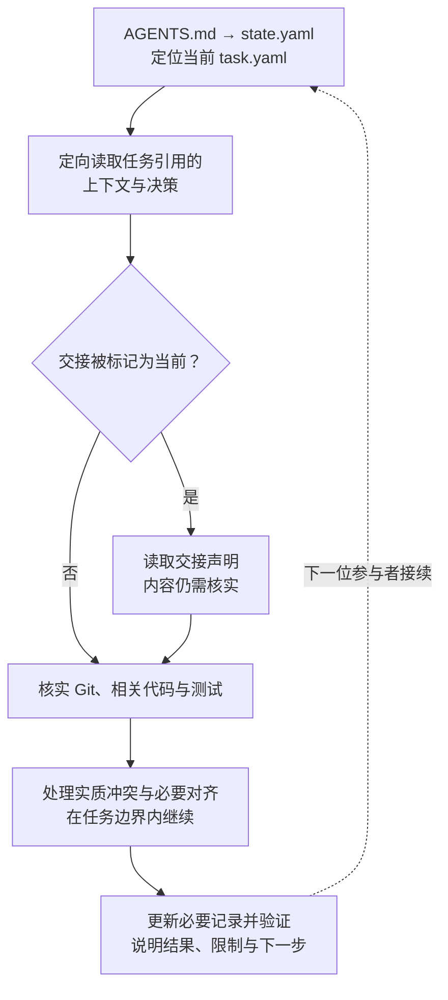
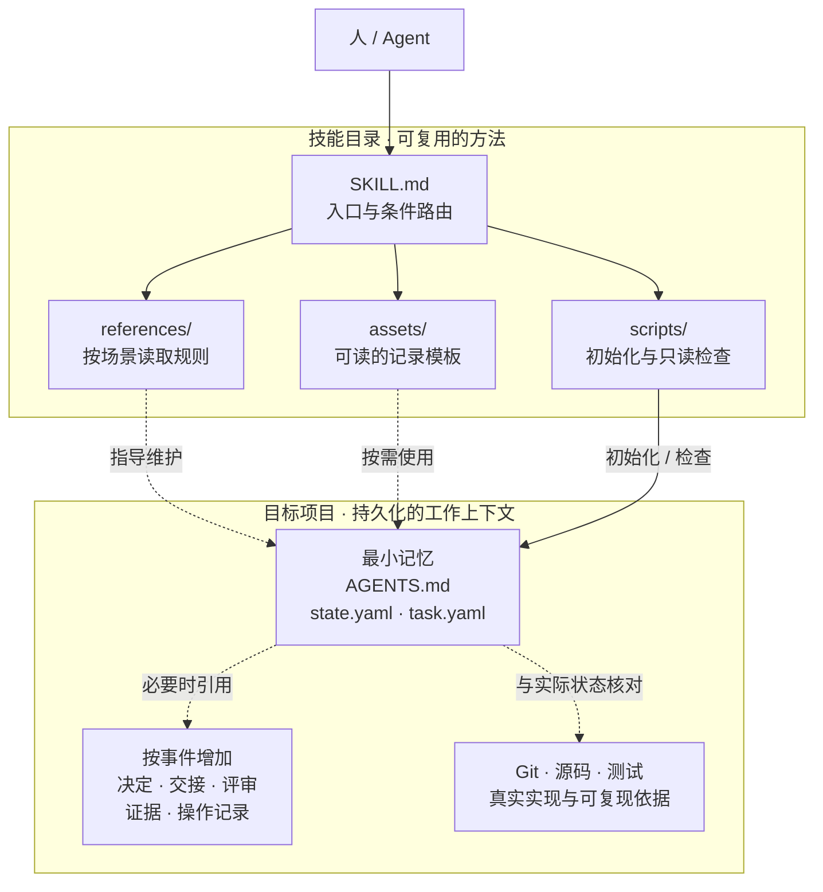

# Managing Vibe Project Memory

> 把目标、边界与必要决定留在仓库，让下一位 Agent 接得上。

一个宿主无关的 Agent Skill，用于跨会话、跨 Agent、跨执行环境的项目续作。默认只创建 **3 个项目记忆文件**，决策、交接、评审等记录按需增加。当前支持 schema 3 / protocol 3.0。

[安装](#installation) · [使用](#quickstart) · [设计原则](#principles) · [工作方式](#workflow) · [架构](#architecture) · [命令](#commands) · [贡献](#contributing)

<a id="capabilities"></a>

## 它解决什么问题

Git 能说明代码如何变化，却不一定说明当前目标、允许范围和未决选择；聊天包含这些信息，但难以跨会话可靠恢复。

| 常见问题 | 本技能的做法 |
| --- | --- |
| 换会话后重新解释任务，或实现偏离需求 | 保存恢复焦点、目标、范围、非目标与验收条件 |
| 重要决定只留在聊天里 | 记录选择依据及适用边界 |
| 把旧评审或交接当成当前事实 | 将声明绑定具体版本，检查是否过期 |
| 将测试通过、设计批准和用户验收混为“完成” | 分开记录结论与证据 |
| 并行合并或外部操作留下不确定结果 | 保留集成依据、操作身份与结果核实记录 |

目标不是保存全部历史，而是让下一位参与者知道：**做什么、不做什么、依据什么、从哪里继续。**

<a id="installation"></a>

## 安装

在目标项目目录运行，按提示选择 Agent：

```bash
npx skills add zianai/managing-vibe-project-memory
```

跨项目使用时加 `-g`：

```bash
npx skills add zianai/managing-vibe-project-memory -g
```

也可以直接告诉 Agent：

```text
帮我安装这个 skill：
https://github.com/zianai/managing-vibe-project-memory
不要覆盖已有同名技能或本地修改。
```

[skills CLI](https://github.com/vercel-labs/skills) 需要 Node.js 与 npm（[版本要求](https://github.com/vercel-labs/skills/blob/main/package.json)）；这是安装器的依赖，不是技能的运行依赖。

<details>
<summary>手动安装与其他选项</summary>

将完整仓库克隆到宿主支持的技能目录，不要只复制 `SKILL.md`：

```bash
git clone https://github.com/zianai/managing-vibe-project-memory.git \
  /absolute/path/to/your-agent-skills/managing-vibe-project-memory
```

指定 Agent 或仅查看技能：

```bash
npx skills add zianai/managing-vibe-project-memory --agent codex claude-code
npx skills add zianai/managing-vibe-project-memory --list
```

安装位置和自动发现取决于宿主；不支持自动发现时，明确让 Agent 读取安装目录中的 `SKILL.md`。本仓库不是插件市场安装包。

</details>

<a id="quickstart"></a>

## 使用

**安装让 Agent 获得方法；初始化才会在目标项目中创建记忆。** 正常使用只需说明需求，辅助命令可由 Agent 执行。

首次接入：

```text
使用 managing-vibe-project-memory 为当前项目建立最小记忆。
这次修复登录表单输入校验，不改登录流程和接口。
先检查已有约定、预览新增文件，再记录目标、边界和验收条件。
```

新会话续作：

```text
使用 managing-vibe-project-memory 恢复当前任务。
核实目标、边界、已有决定和 Git 状态后继续。
```

收尾时，Agent 更新实际结果、限制与下一步；仅在现有记录不足以恢复时补充交接。它不是常驻服务，新会话仍需加载技能或读取项目入口。

辅助脚本需要 Python 3.10+，部分检查需要 Git；无第三方 Python 依赖或 API key。初始化适合 macOS、Linux、WSL，不承诺原生 Windows 支持。只能读文件的宿主可以恢复和分析，但不能声称已写入或运行检查。

<a id="principles"></a>

## 设计原则

1. **只保存必要的跨会话信息。** 未来需要、不能从代码/Git/测试低成本可靠重建、交接后仍有用，才值得记录。例如“不更换认证服务”值得保留，打开文件的过程通常不值得。
2. **一个事实只有一个可编辑归属。** 状态管理焦点，任务管理边界，决策管理选择，Git 管理代码；其他位置用引用，避免多份记录互相矛盾。
3. **风险决定验证强度，事件决定文件数量。** 本地可逆修复可自检；高影响操作需要相应授权与独立验证。有真实决定、交接或评审时才建记录，不预填空套件。
4. **声明有对象，也有有效期。** 评审针对具体提交、补丁或制品；对象变化后，旧结论不能替新版本背书。
5. **不同结论不能互相替代。** 已实现、测试通过、独立验证、设计批准、完成验收和目标用户验证各需依据；测试成功不等于人已批准。
6. **约束恢复边界，不接管执行方式。** 不规定模型、工具、Agent 数量或代码架构。内部子 Agent 只需局部目标与约束，由协调者整合持久记忆。

<a id="workflow"></a>

## 工作方式

Agent 加载 [SKILL.md](SKILL.md) 后，按以下顺序恢复目标项目：



任务的 `context_refs`、`decision_refs` 指向必要上下文；仅当 `handoff_current: true` 时读取 `handoff_ref`。交接是待核实的声明，不能替代检查实际 Git、代码与测试。

工作中，Agent 更新变化的任务事实，并按事件读取相关规则、创建记录。明确授权的低风险工作直接推进；范围、风险或人的保留选择发生实质变化时才重新对齐。

例如修复登录校验：第一个 Agent 保存“不改认证流程”的边界，完成部分实现；第二个 Agent 从任务与 Git 恢复后继续。只有无法重建的调查线索才需要 handoff，不必重写已有任务说明。

**职责分工：** 人决定目标、保留选择与必要授权；Agent 判断语义、执行并维护记录；初始化器安全创建文件；检查器只验证可机械判断的约束。

<a id="architecture"></a>

## 架构与数据

技能目录保存可复用的方法；目标项目保存自己的记忆，两者分离：



`SKILL.md` 负责入口和条件路由，`references/` 提供场景规则，`assets/` 提供可读模板，`scripts/` 分离初始化与只读检查。图中是使用关系，不是后台自动执行链路。

### 最小内核

```text
your-project/
├── AGENTS.md                          恢复与维护约定
├── project/state.yaml                 项目身份与默认恢复焦点
└── work/active/T-001-initial/task.yaml  目标、边界、验收、风险与引用
```

约定、焦点和任务分开，便于切换任务而不重写其内容。`active_task` 不是锁，多个活动任务可以并存。

<details>
<summary>完整记录示例：登录校验修复</summary>

`project/state.yaml`：

```yaml
schema_version: 3
protocol_version: "3.0"
project_id: LOGIN-DEMO
project_name: "Login Demo"
status: active
active_task: T-001-login-validation
updated: "2026-09-09"
```

`work/active/T-001-login-validation/task.yaml`：

```yaml
schema_version: 3
protocol_version: "3.0"
id: T-001-login-validation
status: proposed
goal: "修复登录表单对空白输入的校验"
scope: ["src/login/"]
non_goals: ["不更换认证服务", "不改登录流程", "不部署到生产"]
acceptance: ["空白输入被拦截", "合法输入保持原行为", "相关回归测试通过"]
risk: low
risk_reasons: [local-reversible]
protected_paths: ["src/auth/"]
context_refs: []
decision_refs: []
evidence_refs: []
updated: "2026-09-09"
```

这是任务草稿示例，不是已完成声明。`scope` 是语义范围，`protected_paths` 是精确硬保护；引用相对于项目根目录，不得越界或经过符号链接。完整字段见[连续性内核](references/continuity-kernel.md)。

</details>

<a id="scenarios"></a>

## 按需扩展

适合长期开发、Agent 接力、重要决策和高影响工作。一次性问答或已有文档足以恢复的任务，不必增加记录。

| 何时需要 | 使用什么 |
| --- | --- |
| 选择会影响后续实现 | [decisions](assets/project-template/optional/decisions.md)：问题、决定、条件与依据 |
| 责任转移且必要上下文会丢失 | [handoff](assets/project-template/optional/handoff.md)：未完成线索、风险与下一步 |
| 需要保留正式验证结论 | [review](assets/project-template/optional/review.md)：对象、方式、证据与局限 |
| 人保留关键选择，或范围、风险变化 | [人类对齐](references/human-alignment.md)：确认相应决定，不重复审批普通步骤 |
| 重要视觉选择或设计一致性声明 | [视觉对齐](references/visual-alignment.md)：批准基线与真实实现渲染的比较 |
| 发布、支付、消息、敏感数据或不可逆操作 | [高影响规则](references/high-impact-actions.md)与[操作记录](assets/project-template/optional/action-record.md)：授权、操作身份、结果与恢复路径 |
| 独立执行环境并发写入、需要合并 | [并行协作](references/parallel-harness.md)：共同基线、来源版本与集成验证 |

视觉比较不能仅靠源码或设计稿。外部结果不明时，应标记 `unknown`、禁止盲目重试，先核实目标系统；高影响完成需当前独立评审覆盖操作记录。并行工作则需在合并结果上重新验证，分支隔离不等于语义冲突已解决。

<a id="commands"></a>

## 命令参考

需要手动操作时，将以下路径替换为实际位置：

```bash
MEMORY_SKILL="/absolute/path/to/managing-vibe-project-memory"
MEMORY_PROJECT="/absolute/path/to/your-project"

# 预览后初始化；再将初始任务占位内容改为真实需求
python3 "$MEMORY_SKILL/scripts/project_memory.py" init "$MEMORY_PROJECT" --dry-run
python3 "$MEMORY_SKILL/scripts/project_memory.py" init "$MEMORY_PROJECT" --project-name "My Project"

# 当前焦点 / 所有受管理的活动与归档任务
python3 "$MEMORY_SKILL/scripts/project_memory.py" check "$MEMORY_PROJECT" --focus
python3 "$MEMORY_SKILL/scripts/project_memory.py" check "$MEMORY_PROJECT" --full

# 只输出模板或规则，不创建文件
python3 "$MEMORY_SKILL/scripts/project_memory.py" template handoff
python3 "$MEMORY_SKILL/scripts/project_memory.py" guide high-impact-actions
```

`check` 只读，默认等同于 `--focus`；`--focus` 与 `--full` 互斥。省略项目路径使用当前目录。初始任务为 `proposed`，检查通过仅说明结构成立，仍需填实需求并完成实际验收。

<details>
<summary>可选参数、模板与直接入口</summary>

- `init --project-name / --project-id / --task-id`：自定义名称与标识。
- `init --adapter claude / --adapter codex`：创建薄入口 `CLAUDE.md` / `CODEX.md`，可重复指定。
- `init --with-milestones`：增加 `milestones/M01/milestone.yaml` 与 `brief.md`。
- `template` 名称：`agents`、`state`、`task`、`decisions`、`handoff`、`review`、`action`。
- `guide` 名称：见[协议索引](#protocol-reference)。子命令加 `--help` 查看参数。

[项目约定](assets/project-template/AGENTS.md)、[状态](assets/project-template/project/state.yaml)、[任务](assets/project-template/templates/task/task.yaml)和[可选记录](references/continuity-kernel.md#record-templates)均可直接阅读。`template` 不替换占位符；初始化器会填入标识与日期。

直接脚本调用同一实现：

```bash
python3 "$MEMORY_SKILL/scripts/init_project_memory.py" "$MEMORY_PROJECT" --dry-run
python3 "$MEMORY_SKILL/scripts/check_project_memory.py" "$MEMORY_PROJECT" --full
```

返回码：`0` 成功，`1` 检查未通过，`2` 参数、初始化或资源读取错误。

</details>

<a id="limitations"></a>
<a id="faq"></a>

## 边界与常见问题

**已有 AGENTS.md 怎么接入？**

先阅读现有约定并人工整合。初始化器仅在现有内容与模板精确一致时直接继续，不提供强制覆盖；遇到不兼容状态、受保护路径或符号链接重定向会停止。

**检查能保证什么？**

可发现结构、引用、保护路径、版本及声明一致性问题；不能证明授权者身份、外部结果、审美、业务价值或消除并发竞态。已有及来源不明的改动必须保留，记录冲突不能静默覆盖。

**是否支持旧协议或任意 YAML？**

仅支持 schema 3 / protocol 3.0，不自动迁移。核心 YAML 支持有限的标量与列表，不是通用 YAML 解析器。

**是否会自动编排 Agent？**

不会。它不是聊天备份、记忆数据库或任务调度器，不自行启动 Agent 或执行外部操作。宿主是否自动发现技能和 `AGENTS.md`，由宿主决定。

<a id="contributing"></a>

## 开发与贡献

### 源码入口

| 想修改什么 | 从这里开始 |
| --- | --- |
| 触发与恢复流程 | [SKILL.md](SKILL.md) |
| 协议与场景约束 | [references](references/continuity-kernel.md) |
| 生成的记录 | [项目模板](assets/project-template/AGENTS.md) |
| 初始化与冲突处理 | [init_project_memory.py](scripts/init_project_memory.py)：`initialize` |
| 结构、引用与声明检查 | [check_project_memory.py](scripts/check_project_memory.py)：`check_project_v3`、`v3_validate_task` |
| 命令路由与资源输出 | [project_memory.py](scripts/project_memory.py)：`GUIDE_SECTIONS`、`TEMPLATE_FILES` |

扩展遵循三个要求：

1. 新事实先确定唯一归属；项目特有字段用 `x_*`，复杂内容放引用文件或支持的不透明扩展块。
2. 协议变动同步规则、模板与检查逻辑；新增场景更新技能路由。外部集成优先用 CLI，当前不承诺稳定 Python 库 API。
3. 保留只读检查、排他创建和路径保护；新增依赖、发布文件或协议变更先提 Issue 讨论。

### 本地验证

在仓库根目录运行，演示项目放临时目录：

```bash
MEMORY_DEMO="$(mktemp -d)"
MEMORY_DEMO="$(cd "$MEMORY_DEMO" && pwd -P)"

python3 -B scripts/project_memory.py init "$MEMORY_DEMO/demo" --dry-run
python3 -B scripts/project_memory.py init "$MEMORY_DEMO/demo"
python3 -B scripts/project_memory.py init "$MEMORY_DEMO/demo"
python3 -B scripts/project_memory.py check "$MEMORY_DEMO/demo" --focus
python3 -B scripts/project_memory.py check "$MEMORY_DEMO/demo" --full
git diff --check
```

预期：预览不写入，首次创建 3 个文件，重复初始化跳过已有文件，草稿通过检查。`pwd -P` 用于避免临时目录的符号链接触发保护。

这只是冒烟验证。行为修改还需覆盖正常和拒绝路径；指令修改应验证新会话恢复、低风险不过度记录、受限宿主如实报告等实际表现。发布目录不含测试工程，但 PR 必须提供可复现依据。

### 提交 Issue / PR

- [Issue](https://github.com/zianai/managing-vibe-project-memory/issues/new)：提交号、运行环境、预期与实际行为、最小复现。先查[已有问题](https://github.com/zianai/managing-vibe-project-memory/issues)。
- [PR](https://github.com/zianai/managing-vibe-project-memory/pulls)：从 fork 分支提交到 `main`，说明改动影响、验证结果与未覆盖范围；缺陷修复附修改前后的复现结果。

不提交凭据、业务数据、缓存或个人测试项目。安全问题先向维护者请求私下沟通渠道。

<a id="protocol-reference"></a>

## 协议索引

[连续性内核](references/continuity-kernel.md) · [人类对齐](references/human-alignment.md) · [视觉对齐](references/visual-alignment.md) · [高影响操作](references/high-impact-actions.md) · [并行协作](references/parallel-harness.md)

详细规则以这些文件为准；`guide` 输出同一份内容。图表为内嵌 Mermaid，不支持渲染的阅读器可直接阅读相邻说明。

<a id="license"></a>

## 许可

仓库尚未指定许可证。公开可见不等于授予开源使用、修改或分发许可，相关事宜请与维护者确认（[GitHub 说明](https://docs.github.com/en/repositories/managing-your-repositorys-settings-and-features/customizing-your-repository/licensing-a-repository)）。
