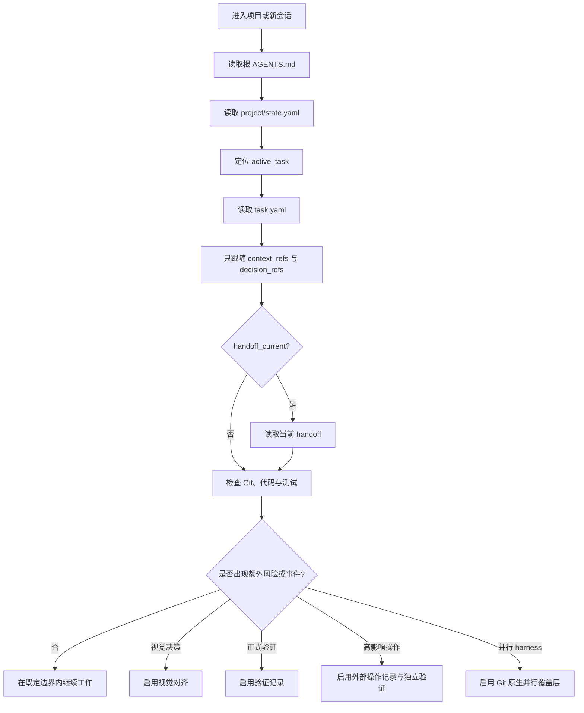

# Managing Vibe Project Memory

> 用最小、可验证、可恢复的仓库状态，让软件项目在不同人类、会话、AI Agent 与执行环境之间保持连续。

**当前协议：3.0 — Minimal Continuity Kernel（最小连续性内核）**

`managing-vibe-project-memory` 是一个面向支持读取技能与项目文件的 AI Agent 的通用 Skill。它解决的不是“如何编排 Agent”，而是一个更基础的问题：当上下文窗口结束、会话切换、执行者更换或多个执行环境（harness）并行工作时，下一个有能力的参与者如何只依靠仓库中的持久信息，快速找到当前工作、理解边界，并安全地继续。

它把项目记忆压缩为一个默认仅包含三个文件的最小内核，并在确实发生决策、交接、正式验证、视觉对齐或高影响外部操作时，才按事件创建额外记录。

## 目录

- [它解决什么问题](#它解决什么问题)
- [设计原则](#设计原则)
- [适用与不适用场景](#适用与不适用场景)
- [最小连续性内核](#最小连续性内核)
- [工作方式](#工作方式)
- [安装技能](#安装技能)
- [快速开始](#快速开始)
- [命令参考](#命令参考)
- [协议数据结构](#协议数据结构)
- [风险自适应覆盖层](#风险自适应覆盖层)
- [事件触发记录](#事件触发记录)
- [恢复与交接](#恢复与交接)
- [安全边界](#安全边界)
- [典型工作流](#典型工作流)
- [仓库结构](#仓库结构)
- [开发与测试](#开发与测试)
- [常见问题](#常见问题)
- [许可](#许可)

<a id="capabilities"></a>

## 它解决什么问题

长周期的软件项目常见以下连续性断点：

- 新会话必须重新阅读大量聊天记录，才能知道项目正在做什么；
- Agent 知道实现细节，却不知道用户批准了什么、保留了什么选择；
- 任务进度存在于临时对话里，切换执行者后无法可靠恢复；
- 测试通过、独立验证、设计批准和用户验收被混成一个模糊的“完成”；
- 多个执行环境并行修改后，只剩分支和提交，却缺少必要的语义边界；
- 发布、付款、消息发送或生产操作超时后，被盲目重试并造成重复影响；
- 项目为防止这些问题而建立过重的治理体系，最终维护成本超过收益。

本技能的目标是让仓库状态足以回答四个问题：

1. 当前默认关注的任务是什么？
2. 这个任务的目标、范围、非目标、验收条件和风险是什么？
3. 哪些不可从代码、Git 或测试中可靠推导的信息必须保留？
4. 下一位参与者怎样在不重放全部历史的情况下安全继续？

<a id="principles"></a>

## 设计原则

### 1. 只保存边界记忆

一个事实只有同时满足以下条件，才值得持久化：

1. 未来工作确实需要它；
2. Git、代码、测试或现有工具无法低成本、可靠地推导它；
3. 它跨越预期的会话、人员或执行环境边界后仍然有效。

### 2. 一个事实只有一个可写归属

状态、任务边界、决策、代码字节、交接声明、正式验证结论和外部操作状态分别有自己的唯一归属。优先引用，不复制同一事实到多个文件，避免不同记录逐渐互相矛盾。

### 3. 按风险增加结构

低风险、可逆的本地工作通常只需要清晰任务边界和自检。视觉对齐、独立验证、高影响操作或并行 harness 规则，按实际风险和场景启用。

### 4. 事件触发，而不是预先铺满模板

默认初始化不会创建空的决策、交接、评审、证据或设计目录。只有事件真的发生、且信息无法从现有状态恢复时，才创建对应记录。

### 5. 区分不同强度的结论

以下结论互不等价：

- 已实现；
- 测试已通过；
- 已独立验证；
- 视觉偏好已获人类批准；
- 残余风险已被接受；
- 已通过目标用户验证。

技能要求声明与证据保持一致，不把其中一个自动升级为另一个。

<a id="scenarios"></a>

## 适用与不适用场景

### 适合使用

- 项目会跨多个会话持续推进；
- 人类与 Agent 需要共享清晰的目标、边界与验收条件；
- 不同 Agent、模型或 harness 会接力同一项目；
- 项目包含需要长期保留的产品或架构决策；
- UI、交互或视觉偏好需要在高成本实现前确认；
- 存在生产发布、敏感数据、付款、消息、账号或其他高影响操作；
- 多个独立执行环境会通过 Git 分支或 worktree 并行修改；

### 不负责

本技能不是 Agent 编排器，也不会规定：

- Agent 的数量、角色或身份；
- DAG、工作流图或并行拓扑；
- 模型、harness、工具或提示词选择；
- 内部推理过程或上下文压缩方式；
- 代码架构、测试框架、分支名称或提交数量；
- 所有 UI 任务必须经过固定数量的视觉关卡；
- 所有任务都必须生成完整治理文档包。

这些属于执行环境或项目自身的选择。协议只保护跨边界恢复所需的最小持久语义。

<a id="architecture"></a>

## 最小连续性内核

默认初始化只创建三个文件：

```text
project-root/
├── AGENTS.md
├── project/
│   └── state.yaml
└── work/
    └── active/
        └── T-001-initial/
            └── task.yaml
```

三个文件分别承担不同职责：

| 文件 | 唯一职责 |
| --- | --- |
| `AGENTS.md` | 告诉进入仓库的 Agent 如何恢复项目上下文 |
| `project/state.yaml` | 保存项目身份与默认恢复焦点 `active_task` |
| `work/active/<task-id>/task.yaml` | 保存任务目标、范围、非目标、验收、风险、保护路径和引用 |

`active_task` 只是进入项目时的默认关注点，不是全局互斥锁。`work/active/` 中可以同时存在多个任务。

<a id="workflow"></a>

## 工作方式



恢复过程是定向读取，不是全仓库治理扫描。只有当前任务引用的上下文、决策和已激活记录需要进入上下文。

<a id="installation"></a>

## 安装技能

在目标项目目录运行，按提示选择 Agent：

```bash
npx skills add zianai/managing-vibe-project-memory
```

跨项目使用时加 `-g`：

```bash
npx skills add zianai/managing-vibe-project-memory -g
```

也可以直接告诉 Agent：

```text
帮我安装这个 skill：
https://github.com/zianai/managing-vibe-project-memory
不要覆盖已有同名技能或本地修改。
```

[skills CLI](https://github.com/vercel-labs/skills) 需要 Node.js 与 npm（[版本要求](https://github.com/vercel-labs/skills/blob/main/package.json)）；这是安装器的依赖，不是技能的运行依赖。

<details>
<summary>手动安装与其他选项</summary>

将完整仓库克隆到宿主支持的技能目录，不要只复制 `SKILL.md`：

```bash
git clone https://github.com/zianai/managing-vibe-project-memory.git \
  /absolute/path/to/your-agent-skills/managing-vibe-project-memory
```

指定 Agent 或仅查看技能：

```bash
npx skills add zianai/managing-vibe-project-memory --agent codex claude-code
npx skills add zianai/managing-vibe-project-memory --list
```

安装位置和自动发现取决于宿主；不支持自动发现时，明确让 Agent 读取安装目录中的 `SKILL.md`。本仓库不是插件市场安装包。

</details>

<a id="quickstart"></a>

## 快速开始

### 1. 调用技能

安装技能让 Agent 获得方法，初始化则在目标项目中创建记忆。可以直接告诉 Agent：

```text
使用 managing-vibe-project-memory 为这个仓库建立最小的跨会话项目记忆。
先预览将创建的文件，不要覆盖任何现有内容。
```

自动发现和隐式调用取决于宿主；不支持时，明确让 Agent 读取安装目录中的 `SKILL.md`。下面的辅助命令可以由具备执行能力的 Agent 运行，路径需替换为实际位置。

运行脚本需要 Python 3.10+，部分检查需要 Git；无第三方 Python 依赖或 API key。初始化依赖 POSIX 能力，适合 macOS、Linux 或 WSL。只读取协议和模板不需要 Python；无法执行时，应说明机械检查未运行。

### 2. 预览初始化

始终先使用 `--dry-run` 查看计划写入：

```bash
python3 "<skill-dir>/scripts/init_project_memory.py" "<project-root>" \
  --project-name "Project Name" \
  --dry-run
```

### 3. 创建最小内核

确认预览后执行：

```bash
python3 "<skill-dir>/scripts/init_project_memory.py" "<project-root>" \
  --project-name "Project Name"
```

初始化器不会覆盖已有路径。如果现有状态不兼容、根 `AGENTS.md` 需要人工合并、目标路径受保护或路径通过符号链接改变权威位置，它会在写入前停止。

### 4. 验证恢复焦点

```bash
python3 "<skill-dir>/scripts/check_project_memory.py" "<project-root>"
```

默认即 `--focus` 模式，验证当前恢复焦点、引用、保护路径、已激活覆盖层和声明一致性。初始任务是 `proposed` 草稿；请填实目标、范围、非目标和验收条件，检查通过不等于任务完成。

<a id="commands"></a>

## 命令参考

### 初始化器

```text
python3 scripts/init_project_memory.py [project_root] [options]
```

| 参数 | 作用 |
| --- | --- |
| `--project-name NAME` | 设置人类可读的项目名称 |
| `--project-id ID` | 显式设置稳定的项目标识 |
| `--task-id ID` | 设置初始任务标识，默认语义为 `T-001-initial` |
| `--adapter claude` | 添加 Claude 的薄入口指针，可重复使用 |
| `--adapter codex` | 添加 Codex 的薄入口指针，可重复使用 |
| `--with-milestones` | 显式创建可选的里程碑结构 |
| `--dry-run` | 只显示计划变更，不写入文件 |

适配器与里程碑是便利入口，不是新的权威来源。默认初始化保持为三个文件。

### 验证器

```text
python3 scripts/check_project_memory.py [project_root] [mode]
```

| 模式 | 适用时机 | 检查范围 |
| --- | --- | --- |
| 默认 / `--focus` | 日常工作、恢复上下文 | 状态、当前任务、引用、保护路径、当前声明与已激活覆盖层 |
| `--full` | 完成、归档、CI、审计 | 所有受管理的活动与归档记录，以及完成声明一致性 |

`--focus` 与 `--full` 互斥，省略项目路径时使用当前目录。选中的记录必须声明 schema 3 / protocol 3.0；检查只读，不改写记录。

验证器检查结构、引用、状态与声明一致性，但不会判断审美质量、文字质量、Agent 拓扑或实现方案是否聪明。

### 统一入口与资源读取

`project_memory.py` 的 `init` / `check` 调用上述同一实现，`template` / `guide` 只输出资源：

```bash
python3 "<skill-dir>/scripts/project_memory.py" init "<project-root>" --dry-run
python3 "<skill-dir>/scripts/project_memory.py" check "<project-root>" --full
python3 "<skill-dir>/scripts/project_memory.py" template handoff
python3 "<skill-dir>/scripts/project_memory.py" guide continuity-kernel
```

模板名称：`agents`、`state`、`task`、`decisions`、`handoff`、`review`、`action`。规则名称见[协议索引](#protocol-reference)。模板保留待填写的占位符，不代表批准或执行成功；也可以直接打开[模板文件](references/continuity-kernel.md#record-templates)，不必运行命令。

返回码：`0` 成功；`1` 项目检查未通过；`2` 参数、初始化或资源读取错误。各子命令支持 `--help`。

## 协议数据结构

### `project/state.yaml`

```yaml
schema_version: 3
protocol_version: "3.0"
project_id: SAMPLE
project_name: "Sample"
status: active
active_task: T-001-initial
updated: "2026-08-19"
```

`active_task` 定义默认恢复焦点。它可以指向 proposed、blocked 或 executing 状态的任务，也不会阻止其他任务并存。

### `task.yaml`

```yaml
schema_version: 3
protocol_version: "3.0"
id: T-001-initial
status: proposed
goal: Deliver one observable outcome
scope: [src/]
non_goals: [Production deployment]
acceptance: [Relevant tests pass]
risk: low
risk_reasons: [local-reversible]
protected_paths: []
context_refs: []
decision_refs: []
evidence_refs: []
updated: "2026-08-19"
```

关键字段：

| 字段 | 含义 |
| --- | --- |
| `goal` | 一个可观察的目标结果 |
| `scope` | 任务的语义边界，不要求机械地列出每个文件 |
| `non_goals` | 本任务明确不做的事情 |
| `acceptance` | 判断工作满足要求的证据或条件 |
| `risk` / `risk_reasons` | 风险等级与理由，用于决定是否启用额外覆盖层 |
| `protected_paths` | 精确硬保护；不得修改、暂存、提交、删除、移动、覆盖或 stash |
| `context_refs` | 恢复当前任务所需的本地上下文引用 |
| `decision_refs` | 当前工作依赖的持久决策引用 |
| `evidence_refs` | 需要长期保留、可复现的证据引用 |

所有项目引用都必须相对于项目根目录、留在项目内部，并且不能通过符号链接穿越权威边界。协议允许项目添加扩展字段；只要它们不与核心字段冲突，验证器会安全忽略未知扩展。

### 权威优先级

当信息冲突时，按以下顺序判断：

1. 当前直接人类指令与平台规则；
2. `project/state.yaml` 中的项目恢复焦点；
3. 当前任务 `task.yaml` 中的目标与边界；
4. 被引用的持久决策；
5. 实际代码、测试与 Git 历史；
6. 交接与评审声明；
7. 归档记录与聊天摘要。

高优先级来源不会静默抹掉低优先级记录。遇到影响当前编辑的实质冲突时，应停止、暴露冲突，并在正确的归属文件中记录解决结果。

<a id="protocol-reference"></a>

## 风险自适应覆盖层

覆盖层只在触发条件出现时启用。人类对齐用于明确目标、保留选择、范围变化与必要验收；不是每个任务固定要走的审批关卡。

| 覆盖层 | 典型触发条件 | 核心要求 |
| --- | --- | --- |
| 视觉对齐 | 人类保留视觉偏好；IA/交互未决；实现成本高；UI 涉及安全、隐私或高影响操作 | 用最小但足以暴露真实决策的媒介；把批准基线与实现渲染绑定到稳定主体 |
| 正式验证 | 中风险工作适合新上下文检查；高影响工作需要独立检查 | 结论绑定精确 commit、patch、工件或稳定版本；修改后旧结论失效 |
| 高影响操作 | 生产、发布、敏感数据、付款、消息、账号、安全、法律或不可逆后果 | 受限的一次性授权、幂等标识、观察、对账、补偿路径与独立验证 |
| 并行 harness | 多个独立执行环境确实会同时修改并需要独立恢复或合并 | 优先为每个 harness 使用独立分支/worktree；记录共同基线与精确 source head；集成后联合验证 |

详细说明：

- [连续性内核](references/continuity-kernel.md)：`continuity-kernel`
- [人类对齐](references/human-alignment.md)：`human-alignment`
- [视觉对齐](references/visual-alignment.md)：`visual-alignment`
- [高影响外部操作](references/high-impact-actions.md)：`high-impact-actions`
- [并行 Harness](references/parallel-harness.md)：`parallel-harness`

## 事件触发记录

以下记录都不是默认必建文件。可从[记录模板](references/continuity-kernel.md#record-templates)开始填写：

| 记录 | 何时创建 | 不代表什么 |
| --- | --- | --- |
| `decisions.md` | 后续工作依赖一个无法从代码或 Git 可靠解释的选择 | 不自动代表人类批准所有后果 |
| `handoff.md` | 责任确实跨会话、Agent 或 harness 转移，且现有状态遗漏了下一位执行者需要的瞬时语义 | 不是权威、批准、验证或人类关卡 |
| `review.md` | 需要保存正式验证结论 | 不代表用户验收、设计批准或风险接受 |
| `evidence/` | 后续复现、审计、视觉比较或高影响验证需要持久证据 | 不要求复制所有可廉价重跑的测试输出 |
| `design/` | 视觉覆盖层已激活，且本地工件对恢复有价值 | 不是每个 UI 任务的固定模板要求 |
| action record | 高影响外部操作已获授权或被尝试 | 不得包含密钥或其他秘密 |

### 交接新鲜度

任务只保存 `handoff_ref` 与 `handoff_current`。交接文件自身的 front matter 绑定精确任务和主体。主体变化后，`handoff_current` 必须变为 `false`，直到交接内容被刷新。真实交接发生且存在会丢失的必要信息时，Agent 应主动维护交接，不必等用户请求。

### 评审新鲜度

正式评审只对它明确绑定的 commit、patch 或工件有效。评审者一旦修改被评对象，原评审不能继续证明修改后主体已独立验证，必须重新验证。

## 恢复与交接

一个新会话或新的协调者按以下顺序恢复：

1. 读取根 `AGENTS.md`；
2. 读取 `project/state.yaml` 并解析 `active_task`；
3. 读取该任务的 `task.yaml`；
4. 只读取任务列出的 `context_refs` 与 `decision_refs`；
5. 仅当 `handoff_current: true` 时读取 `handoff_ref`；
6. 在改动前检查当前 Git 状态；
7. 阅读与任务相关的代码和测试，并按需跟随已激活证据；
8. 暴露实质冲突或关键假设，否则在任务边界内继续。

内部子 Agent 不需要重新加载整套项目记忆。协调者只需给它一个委派胶囊：局部目标、边界、验收、相关路径与危险点；最终由协调者把输出重新整合进项目状态。

<a id="limitations"></a>

## 安全边界

协议始终执行以下硬规则：

- 把已有或来源不明的修改、未跟踪文件视为他人拥有；
- 不静默 reset、clean、stash、覆盖、暂存或提交这些改动；
- 精确保护 `protected_paths`；
- 不把 Agent 转述的人类许可当作直接授权；
- 范围、验收或高影响后果增长时重新对齐；
- 高影响操作结果不确定时，先对账再决定是否重试；
- 不盲目重试付款、消息、发布、破坏性或其他非幂等操作；
- 声明绑定的 commit、patch、工件版本或渲染发生变化后，使旧声明失效；
- 不沿治理文件的符号链接穿越项目边界；
- 把并发重命名、硬链接别名和可变/重写 Git 历史视为本地结构检查无法消除的信任边界。

对于高影响外部操作，逻辑操作需要稳定的 `action_id`，并记录目标、环境、受限 payload、精确主体、授权依据、幂等信息、前置条件、状态、观察结果、对账与补偿路径。状态只能是：

```text
planned | authorized | executing | succeeded | failed | unknown | compensated
```

如果超时或回调顺序导致结果不明，应标记为 `unknown`、设置 `retry_allowed: false`，使用操作身份或提供方回执查询真实外部状态，完成对账后再决定下一步。高影响完成需要当前独立评审覆盖具体操作记录，评审不能替人接受残余风险。

## 典型工作流

### 新项目：建立最小记忆

```bash
MEMORY_SKILL="/absolute/path/to/managing-vibe-project-memory"
MEMORY_PROJECT="/absolute/path/to/project"

python3 "$MEMORY_SKILL/scripts/init_project_memory.py" "$MEMORY_PROJECT" \
  --project-name "My Project" \
  --dry-run

python3 "$MEMORY_SKILL/scripts/init_project_memory.py" "$MEMORY_PROJECT" \
  --project-name "My Project"

python3 "$MEMORY_SKILL/scripts/check_project_memory.py" "$MEMORY_PROJECT"
```

然后编辑初始 `task.yaml`，把占位目标、范围、非目标和验收条件替换为当前真实任务。

### 新会话：恢复当前工作

对 Agent 说：

```text
使用 managing-vibe-project-memory 恢复这个仓库的当前任务。
读取最小必要上下文，检查 Git 状态，并在既定边界内继续。
```

### 完成或归档前：进行完整检查

```bash
python3 "<skill-dir>/scripts/check_project_memory.py" "<project-root>" --full
```

`--full` 适合 CI、审计、完成声明和归档，而不是每次小改动都必须执行的固定关卡。

### 并行执行环境：Git 原生协作

当不同 harness 确实会并行写入时：

1. 优先让每个独立写入者使用自己的分支或 worktree；
2. 保存共同基线和精确 source head；
3. 把语义所有权或重叠标注视为提示，而不是锁；
4. 合并时按语义处理冲突；
5. 在组合结果上重新运行验证；
6. 只有在有具体合并/解决证据后，才把集成状态标记为 resolved 或 merged。

## 仓库结构

```text
managing-vibe-project-memory/
├── SKILL.md                         # 技能入口与条件路由
├── README.md                        # 使用与开发指南
├── .gitignore
├── assets/project-template/         # 最小内核与可选记录模板
├── references/
│   ├── continuity-kernel.md         # schema、权威、恢复与验证规则
│   ├── human-alignment.md           # 人类决策与验收
│   ├── visual-alignment.md          # 视觉基线、实现渲染与一致性
│   ├── high-impact-actions.md       # 外部操作、幂等与对账
│   └── parallel-harness.md          # 多执行环境的 Git 原生协作
└── scripts/
    ├── init_project_memory.py       # 安全初始化器
    ├── check_project_memory.py      # 只读一致性检查器
    └── project_memory.py            # 命令转发与资源输出
```

技能目录保存方法，目标项目保存记忆。规则和模板可以直接读取；初始化器与资源输出共用同一份模板，避免维护副本。

<a id="contributing"></a>

## 开发与测试

### 本地验证

在仓库根目录执行，将演示项目放在临时目录：

```bash
MEMORY_DEMO="$(mktemp -d)"
MEMORY_DEMO="$(cd "$MEMORY_DEMO" && pwd -P)"

python3 -B scripts/init_project_memory.py --help
python3 -B scripts/check_project_memory.py --help
python3 -B scripts/project_memory.py init "$MEMORY_DEMO/demo" --dry-run
python3 -B scripts/project_memory.py init "$MEMORY_DEMO/demo"
python3 -B scripts/project_memory.py init "$MEMORY_DEMO/demo"
python3 -B scripts/project_memory.py check "$MEMORY_DEMO/demo" --focus
python3 -B scripts/project_memory.py check "$MEMORY_DEMO/demo" --full
git diff --check
```

预期：预览不写入，首次创建三个文件，重复初始化跳过已有文件，草稿通过检查。`pwd -P` 避免系统临时目录的符号链接触发保护。

冒烟检查不能代替行为回归。修改脚本需验证正常与拒绝路径；修改指令需验证新会话恢复、风险判断和记录维护的实际表现。记录环境、结果与未覆盖范围，测试项目留在独立目录。

### 二次开发与贡献

- 协议改动同步相关规则、模板与检查逻辑；新增场景更新 `SKILL.md` 路由。
- 项目特有字段使用 `x_*`，复杂内容放引用文件或支持的不透明扩展块。核心 YAML 是有限结构，不支持任意 YAML 语法。
- 保留只读检查、排他创建和路径保护。新增依赖或发布文件前，先说明必要性。
- [Issue](https://github.com/zianai/managing-vibe-project-memory/issues)：提供提交号、环境、预期与实际行为、最小复现。
- [PR](https://github.com/zianai/managing-vibe-project-memory/pulls)：从 fork 分支提交到 `main`，说明改动影响、验证结果和未覆盖边界。

不要提交凭据、业务数据、缓存或个人测试工程。安全问题先向维护者请求私下沟通渠道。

<a id="faq"></a>

## 常见问题

### 它会自动管理或限制子 Agent 吗？

不会。协议不规定 Agent 数量、角色、拓扑或内部执行方式。协调者只负责把必要的边界信息交给子 Agent，并在最后整合结果。

### `active_task` 是否意味着一次只能有一个任务？

不是。它只是新参与者进入仓库时的默认恢复焦点。多个任务可以同时存在于 `work/active/`。

### 每次切换会话都要创建 `handoff.md` 吗？

不需要。只有责任确实跨边界转移，而且任务、Git、决策和测试不足以恢复必要的瞬时语义时，才创建或刷新交接记录。

### 每个任务都需要正式 `review.md` 吗？

不需要。低风险、可逆工作可以只保留可重跑的自检结果。正式验证、高影响操作或需要持久审计的结论才需要评审记录。

### 验证器能判断设计是否好看吗？

不能。它能检查稳定主体、引用范围、记录新鲜度和声明一致性，但不能判断审美、可用性、实现智慧或真实提供方来源。

### 为什么默认只有三个文件？

因为协议的目标是连续性，不是文档数量。能从 Git、代码或测试可靠恢复的信息不应重复写入治理记录；额外文件只有在真实事件使它们必要时才出现。

### 它能彻底防止本地篡改或并发竞态吗？

不能。符号链接检查、真实路径解析和主体绑定可以降低风险，但并发重命名、硬链接别名、可变提供方状态和重写 Git 历史仍是必须显式承认的信任边界。

<a id="license"></a>

## 许可

本仓库尚未指定许可证。使用、修改和分发的许可事宜请与维护者确认，参见 [GitHub 说明](https://docs.github.com/en/repositories/managing-your-repositorys-settings-and-features/customizing-your-repository/licensing-a-repository)。
