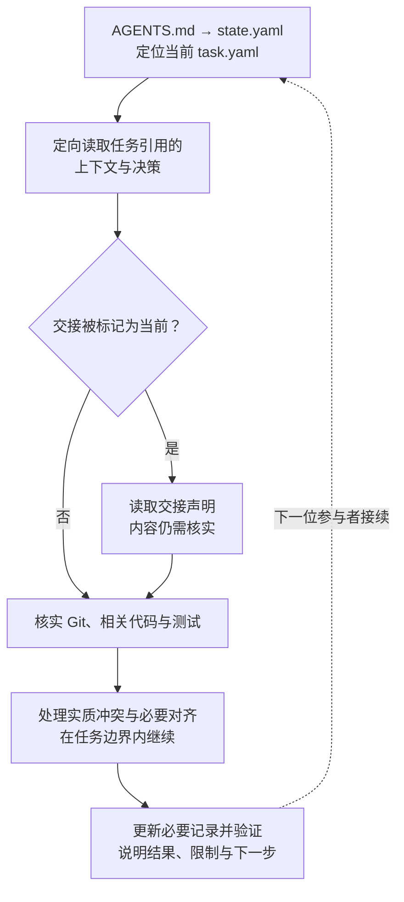
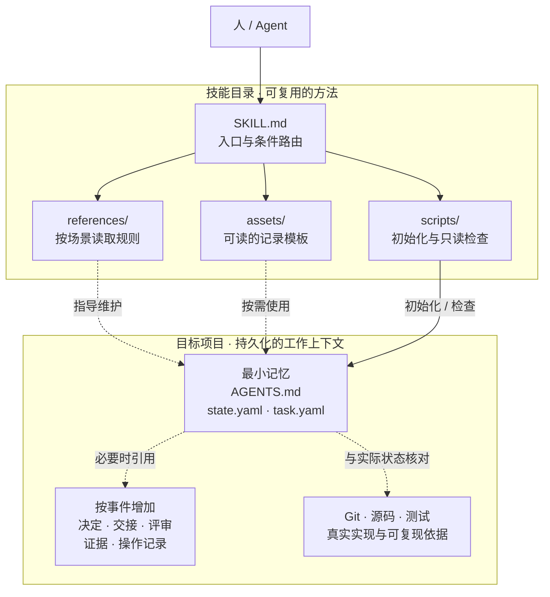

# Managing Vibe Project Memory

> 用最小、可验证、可恢复的仓库状态，让软件项目在不同人类、会话、AI Agent 与执行环境之间保持连续。

`managing-vibe-project-memory` 是一个宿主无关的 Agent Skill。它解决的不是「让模型记住所有聊天」，而是：**当上下文结束、执行者更换或工作环境切换后，下一位参与者如何仅凭仓库，理解当前目标、工作边界与必要决定，并安全地继续。**

核心设计是 **Minimal Continuity Kernel（最小连续性内核）+ 风险与事件驱动的扩展规则**。普通任务默认从 3 个项目记忆文件开始；有真实需要时，再增加决策、交接、评审、视觉证据和外部操作记录。当前支持 schema 3 / protocol 3.0。

[安装](#installation) · [开始使用](#quickstart) · [解决的问题](#capabilities) · [设计原则](#principles) · [工作方式](#workflow) · [架构与数据](#architecture) · [开发与贡献](#contributing)

<a id="capabilities"></a>

## 它解决什么问题

长周期的 Agent 开发，常常不是缺少代码，而是缺少能跨会话保留下来的工作语义：

| 连续性断点 | 只靠聊天或 Git 为什么不够 | 本技能补上的部分 |
| --- | --- | --- |
| 换个会话就要重新解释项目 | 聊天太长；提交记录不一定说明「现在该做哪件事」 | 明确的恢复入口与当前任务指针 |
| 实现继续推进，目标却悄悄偏移 | 代码能展示实现，不能完整表达允许做什么、不做什么 | 目标、范围、非目标、验收与保护路径 |
| 重要选择只存在于上一轮对话 | 后来的人不知道为什么选 A、什么条件下才成立 | 有范围与依据的持久决策 |
| 「完成」变成一个模糊状态 | 测试通过、独立验证、设计批准和用户验收不是同一件事 | 分开表达结论，并关联实际证据 |
| 旧交接或评审被当作当前事实 | 对象可能已经改动，旧结论却仍写着「通过」 | 将声明绑定具体版本，并检查是否过期 |
| 多个执行环境合并后无法判断结果 | 分支隔离不等于语义冲突已经解决 | 共同基线、来源版本与集成验证依据 |
| 发布或消息操作超时后被重复执行 | 超时不等于外部系统没有执行 | 稳定操作身份、结果核实与重试边界 |

解决这些问题也不能以「每个任务都填一套治理表格」为代价。因此，它把目标限定为让仓库能够回答四个问题：

1. 当前默认关注哪个任务？
2. 目标、范围、非目标、验收条件和风险分别是什么？
3. 哪些必要信息无法从代码、Git、测试中可靠地重建？
4. 下一位参与者应该核实什么、从哪里继续？

**与已有工具的关系：** Git 保存代码内容和历史；任务系统可以管理排期；宿主记忆可以保存个人偏好。本技能补充的是项目内可携带的目标、边界、决定与声明依据，不取代这些工具，也不另建一个集中式记忆数据库。

<a id="installation"></a>

## 安装

### 方式一：使用 skills CLI

在需要使用技能的项目目录中运行：

```bash
npx skills add zianai/managing-vibe-project-memory
```

交互运行时，跟随提示选择你的 Agent 与安装方式。若希望安装到用户级目录、跨项目使用：

```bash
npx skills add zianai/managing-vibe-project-memory -g
```

这是 [skills CLI](https://github.com/vercel-labs/skills) 的安装命令：默认项目级，`-g` 为用户级；它支持为不同 Agent 选择安装位置。运行该安装器需要 Node.js 与 npm，Node 版本要求以 [skills CLI 的声明](https://github.com/vercel-labs/skills/blob/main/package.json)为准。**Node.js 是这条安装途径的要求，不是本技能的运行依赖。**

安装前检查来源和将要写入的位置；已有同名技能时，先处理本地定制内容，不要直接覆盖。

### 方式二：让 Agent 帮你安装

把下面这句话发给具备下载和文件写入能力的 Agent：

```text
帮我安装这个 skill：
https://github.com/zianai/managing-vibe-project-memory
按当前 Agent 支持的方式安装，不要覆盖已有的同名技能或本地修改。
```

Agent 应确认适用的安装位置和作用范围；如果宿主没有自动技能发现机制，也可以下载完整目录后，明确让它读取其中的 `SKILL.md`。不能执行安装的宿主应说明限制，而不是声称已经安装。

<details>
<summary>手动安装与指定 Agent</summary>

只想下载文件时，可以将完整仓库克隆到宿主支持的技能目录：

```bash
# 将目标路径替换为当前宿主支持的技能位置
git clone https://github.com/zianai/managing-vibe-project-memory.git \
  /absolute/path/to/your-agent-skills/managing-vibe-project-memory
```

不要只复制 `SKILL.md`：它引用的规则、模板和脚本都属于技能内容。

使用 skills CLI 时，可用 `--agent` 指定受支持的宿主。例如，在当前项目中为 Codex 与 Claude Code 安装：

```bash
npx skills add zianai/managing-vibe-project-memory --agent codex claude-code
```

可先只查看可发现的技能：

```bash
npx skills add zianai/managing-vibe-project-memory --list
```

具体宿主名称、目录和安装行为以 [skills CLI 文档](https://github.com/vercel-labs/skills#supported-agents)及对应宿主说明为准。本仓库是独立技能目录，不提供特定厂商的插件市场安装包。

</details>

<a id="quickstart"></a>

## 开始使用

**安装技能 ≠ 初始化项目。** 安装让 Agent 获得方法；初始化才是在目标项目中创建记忆。你不需要先学会 Python 命令或手动维护每个字段，正常入口是告诉 Agent 你要做什么。

### 新项目或首次接入

```text
使用 managing-vibe-project-memory 为当前项目建立最小记忆。
我们这次要修复登录表单的输入校验，不改登录流程和接口。
先检查现有项目约定、预览新增文件，再记录目标、边界和验收条件。
```

Agent 应检查已有文件、预览初始化、在授权范围内创建记录，并把真实需求写进初始任务。默认结果是：

```text
your-project/
├── AGENTS.md
├── project/state.yaml
└── work/active/T-001-initial/task.yaml
```

已有 `AGENTS.md` 时先阅读并整合约定，不能覆盖。初始任务是 `proposed` 草稿，结构检查通过不代表需求已填完整，更不代表修复完成。

### 新会话、换 Agent 或换执行环境

```text
使用 managing-vibe-project-memory 恢复当前任务。
先说明当前目标、边界、已有决定和下一步，
核实实际 Git 状态后，在已确认的范围内继续。
```

新参与者应直接从仓库恢复，不要求你重新粘贴整段聊天；如果记录与现实存在影响当前工作的冲突，应先说明冲突。

### 工作结束或即将交接

```text
检查本次工作的实际结果，更新下一位参与者需要的项目记忆。
区分已实现、已验证和仍未确认的内容；只有现有记录不足以恢复时才补交接。
```

后续进入新的会话仍需让宿主加载这项技能或读取项目入口。技能不是常驻进程，不会自动监控所有会话。

运行初始化和机械检查需要 Python 3.10+；部分版本检查需要 Git。初始化依赖 POSIX 能力，适合 macOS、Linux 或 WSL，不承诺原生 Windows 支持。脚本只用 Python 标准库，无须 API key、数据库或后台服务。手动操作见[命令参考](#commands)。

<a id="principles"></a>

## 设计原则

### 1. 保存跨边界仍有价值的信息，而不是完整历史

一个事实只有同时满足三个条件，才值得持久化：未来需要；不能从代码、Git、测试或现有工具低成本且可靠地推导；跨过预期的会话或执行者边界后仍然有用。

例如，「这次不更换认证服务」可能影响下一轮实现，值得进入任务边界；「刚打开过哪些文件」通常不值得保留。可重跑的测试日志不必每轮复制，但难以重新获得、未来需要审计的证据应当保存。

这样控制的不是某个固定文件数，而是维护成本：**先保证下一位参与者接得上，再减少没有恢复价值的记录。**

### 2. 一个事实只有一个可编辑的归属

当前焦点放在状态文件，任务边界放在任务文件，持久选择放在决策记录；Git 继续拥有代码内容和历史。其他位置通过引用使用这些信息，不维护另一份长期可编辑的副本。

例如，handoff 可以说明「下一步检查哪条线索」，但不应重新定义任务范围。否则任务文件、交接和聊天摘要很快就会出现三个不同版本的目标。发生实质冲突时，应暴露冲突并修正事实所属的记录，而不是静默选择方便的一份。

### 3. 风险决定对齐深度，事件决定是否增加文件

风险与事件解决的是两个不同问题：

- **风险**决定需要多强的授权、验证和验收：本地可逆修复与真实生产发布不能使用同一完成标准。
- **事件**决定是否产生持久记录：有影响后续的选择才写 decisions，有无法恢复的交接信息才写 handoff，有正式结论才写 review。

明确授权的低风险任务不需要重复审批；高影响操作也不能因为「文件越少越好」而省掉必要依据。初始化不预建空的评审、交接、设计和证据目录。

### 4. 声明只对明确对象成立，并且可能过期

「评审通过」必须回答：评审的是哪个提交、补丁、制品或提供方版本？如果对象已变化，旧评审不能自动替新对象背书。

协议因此区分任务状态与声明依据：任务记录指向交接、评审等制品，制品绑定自己的具体对象。发生相关变化后，旧声明失效，直到按新对象刷新或重新验证。这比在多个文件中重复写「已完成」更容易检查。

### 5. 不把一种证据升级成另一种结论

已实现、测试通过、独立验证、人的设计批准、完成验收、残余风险接受、目标用户验证，是不同的判断。

例如，截图测试成功不能证明人喜欢这个设计；用户批准设计稿不能证明代码已正确实现；另一个 Agent 转述「用户同意了」也不是直接的人类授权。记录必须说明真实依据和局限，不能用一个笼统的 `done` 掩盖这些差异。

### 6. 约束交接边界，不接管 Agent 的内部执行

技能定义的是可恢复的输入、必要的记录、可信声明和安全边界，不规定模型、工具、Agent 数量、角色拓扑、代码架构或提交次数。

因此它可以用于不同宿主：能读文件就能理解规则；有写入能力才能维护记录；具备命令执行和 Python 才能运行机械检查。内部子 Agent 接收局部目标、边界、验收、路径和危险点即可，协调者负责整合需要持久化的结果，不要求每个子 Agent 都重新加载全套项目记忆。

<a id="workflow"></a>

## 工作方式

### 第一步：加载技能，找到恢复入口

宿主加载 [SKILL.md](SKILL.md) 后，Agent 按它提供的流程读取目标项目，而不是在整个仓库里搜索所有治理文档。

如果尚未建立项目记忆，先检查现有约定，预览初始化，再填写真实任务。已有项目则从根 `AGENTS.md` 进入，读取 `project/state.yaml`，用 `active_task` 找到当前任务。

### 第二步：只读取当前工作需要的上下文

先读取任务列出的 `context_refs` 与 `decision_refs`，只在 `handoff_current: true` 时跟随 `handoff_ref`。整体顺序是：



`handoff_current: true` 是读取交接的条件，不是内容真实的保证。交接可能遗漏信息或已与工作区不一致，所以恢复必须回到真实 Git、代码和测试进行核实。相关证据和场景规则仍按当前任务需要读取。

### 第三步：在边界内行动，按事件维护记忆

Agent 将当前指令与持久边界对照，保留已有和来源不明的改动；只有影响当前工作的实质冲突、人的保留选择或风险增长等情形，才需要先解决对应问题。

过程中，目标或状态变化更新任务；出现重要取舍写入决策；需要正式评审或外部操作时再增加对应记录。普通工作不是「每完成一步就输出一份文档」，也没有固定的任务状态流水线。

### 第四步：验证事实与声明，再交接

Agent 运行相关实现检查，并在有能力时用项目记忆检查器检查结构和一致性。默认 / `--focus` 针对当前恢复焦点，`--full` 用于所有受管理的活动、归档任务及收尾审计。

准备跨会话或跨执行者交接时，只有任务、Git、决策和测试仍不足以恢复必要信息，才创建或刷新 handoff；这是真实交接事件触发的工作，不需要等用户特意要求一份总结。

### 人、Agent 与脚本分别负责什么

| 参与者 | 负责的事情 | 不能替代的事情 |
| --- | --- | --- |
| 人 | 提供目标，决定保留的选择，授予必要权限，接受需要本人承担的风险 | 不需要为普通可逆步骤重复审批 |
| Agent | 理解语义、判断风险、选择相关规则、执行工作并维护必要记忆 | 不能把推测或其他 Agent 的转述当成真实授权 |
| 初始化器 | 检查路径和现有约定，安全创建最小文件 | 不负责猜测实际业务需求，不覆盖冲突文件 |
| 检查器 | 核对结构、引用、保护边界、版本与声明一致性 | 不证明业务正确、外部效果、审美或人的意愿 |

### 一个跨会话例子

假设用户要求「修复登录表单的输入校验，不改登录流程」：

1. 第一个 Agent 把目标、允许范围、非目标和可观察验收条件写进任务，开始局部修复。
2. 若用户进一步决定「错误提示保留现有文案」，且这个选择会影响后续工作，就记录其范围与依据，而不是只留在聊天中。
3. 会话结束时，如果源码、任务与测试已能解释下一步，不创建 handoff；如果还有未完成的调查线索无法重建，就补充这部分交接。
4. 第二个 Agent 读取恢复入口与相关引用，检查工作区，再继续同一任务。它不因为换了执行者就重新询问已确认的边界，也不把前一个 Agent 的「测试通过」直接当作当前代码的证明。
5. 修复完成后，报告实际验证结果与未覆盖部分；涉及已保留的人类验收时，再请求对应确认。

<a id="architecture"></a>

## 架构与数据模型

### 两个目录，两个职责

技能目录保存可复用的方法，目标项目保存自己的工作上下文。安装一个技能可以服务多个项目，但项目记忆不会集中写进技能目录。



这不是后台执行链路。图中的关系由 Agent 的读取、判断和命令调用实现；没有自动启动的记忆服务或调度器。

实现分成四部分：

- **入口 `SKILL.md`**：告诉 Agent 何时使用、如何恢复、何时读取额外规则，保持发现与加载成本可控。
- **规则 `references/`**：按连续性、人类对齐、视觉、外部操作和并行协作分开，避免普通任务加载全部细节。
- **模板 `assets/project-template/`**：是人和 Agent 都能直接读取的记录起点，初始化与资源输出使用同一份源文件，不把模板藏在代码里。
- **工具 `scripts/`**：初始化器负责写入，检查器负责只读验证，统一入口负责命令转发。语义判断留给 Agent，可机械检查的约束交给代码。

### 为什么最小内核是三个文件

| 文件 | 保存什么 | 为什么分开 |
| --- | --- | --- |
| `AGENTS.md` | 项目参与者的恢复和维护约定 | 方法相对稳定，不与某个任务的进度混在一起 |
| `project/state.yaml` | 项目身份与默认恢复焦点 `active_task` | 切换关注点不需要重写任务本身 |
| `work/active/<task-id>/task.yaml` | 目标、范围、非目标、验收、风险、保护路径及引用 | 每个任务保有自己的边界，多个任务可以并存 |

`active_task` 只是默认恢复指针，不是「整个项目一次只能做一件事」的锁。协议没有要求所有任务按同一状态序列推进。

### 记录长什么样

下面是说明字段含义的局部修复示例，**不是初始化器自动生成的业务需求，也不是已完成声明**。

`project/state.yaml` 指向任务：

```yaml
schema_version: 3
protocol_version: "3.0"
project_id: LOGIN-DEMO
project_name: "Login Demo"
status: active
active_task: T-001-login-validation
updated: "2026-09-09"
```

对应的 `work/active/T-001-login-validation/task.yaml`：

```yaml
schema_version: 3
protocol_version: "3.0"
id: T-001-login-validation
status: proposed
goal: "修复登录表单对空白输入的校验"
scope: ["src/login/"]
non_goals: ["不更换认证服务", "不改登录流程", "不部署到生产"]
acceptance: ["空白输入被拦截", "合法输入保持原行为", "相关回归测试通过"]
risk: low
risk_reasons: [local-reversible]
protected_paths: ["src/auth/"]
context_refs: []
decision_refs: []
evidence_refs: []
updated: "2026-09-09"
```

`scope` 描述允许工作的语义范围，不要求逐一枚举文件；`protected_paths` 则是精确硬保护，不能修改、暂存、提交、删除、移动、覆盖或 stash。引用路径相对于目标项目根目录，留在项目内部，不通过符号链接越界。

决定、交接、正式评审、证据和外部动作状态各有自己的归属。任务引用这些记录，不把它们的内容全部复制进 `task.yaml`。具体 schema 与声明规则见[连续性内核](references/continuity-kernel.md)。

### 记录发生冲突时怎么办

当前直接人类指令和平台规则优先；状态文件拥有恢复焦点，当前任务拥有目标与边界，持久决策补充选择依据；代码、测试和 Git 用来核实现实；交接与评审是需要验证的声明，归档和聊天摘要用于历史参考。

这不是「高优先级文字可以改变代码事实」。例如，任务写着功能已完成但测试仍失败，Agent 必须报告差异，不能用任务状态覆盖观察。遇到影响编辑的实质冲突，应先解决，并在对应归属文件更新，而不是静默覆盖较旧记录。

<a id="scenarios"></a>

## 应用场景与风险自适应扩展

### 什么时候值得使用

适合持续多轮开发、不同 Agent 接力、产品或架构选择需要跨会话保留，以及视觉确认、外部效果或独立环境并发带来额外风险的项目。

一次性问答、无需恢复的短暂实验，或现有代码与文档已经足以解释工作的任务，不必增加记忆负担。它不负责排期、Agent 调度、模型选择或内部执行拓扑。

### 人类对齐：把问题问在需要的时候

协议中的 H0–H3 是判断角度，而不是每个任务必走的四道审批：

- H0：结果、范围、非目标与验收依据是否清楚？
- H1：哪些选择交给 Agent，哪些由人保留？
- H2：新的决定或后果是否改变了原有授权？
- H3：最终变化与限制是什么，是否需要人接受偏好或残余风险？

清晰的低风险直接指令可以支持继续工作。重要范围变化、高影响后果、偏离已批准基线或未决产品选择，需要相应对齐；换工具、做局部可逆修复或另一位 Agent 接手同一边界，不自动触发重新审批。详见[人类对齐](references/human-alignment.md)。

### 额外记录由真实事件触发

| 事件 | 记录或规则 | 为什么需要 / 何时可以省略 |
| --- | --- | --- |
| 一个选择会约束未来工作 | [decisions](assets/project-template/optional/decisions.md) | 保存问题、决定、适用条件与未决定事项；可从代码可靠理解的局部选择不必重复记录 |
| 责任转移，有必要信息会丢失 | [handoff](assets/project-template/optional/handoff.md) | 补充未完成线索、危险点和下一步；现有任务、Git、决策和测试已足够时省略 |
| 需要保留正式结论 | [review](assets/project-template/optional/review.md) | 说明对象、评审方式、证据和局限；低风险自查不必成为正式记录 |
| 后续审计、复现或比较依赖证据 | `evidence/` 或引用的制品 | 保存未来需要的依据，不归档全部可廉价重跑的输出 |
| 重要视觉或交互选择需要确认 | [视觉对齐](references/visual-alignment.md) | 将人的决定、稳定设计基线与真实实现渲染对应；不要求每个 UI 修改都生成设计包 |
| 发布、支付、消息或不可逆操作 | [操作记录](assets/project-template/optional/action-record.md)与[高影响规则](references/high-impact-actions.md) | 明确授权、目标、操作身份、结果及恢复路径，不能用普通自查替代必要的独立验证 |
| 独立执行环境确实并发写入 | [并行协作](references/parallel-harness.md) | 记录共同基线、来源版本与合并依据；内部子 Agent 不因此变成全局工作流节点 |

### 三类不能省略的判断

**视觉一致性不是「代码写好了」。** 声称符合已批准设计时，需要稳定的设计对象、人的决定，以及真实实现渲染和当前比较结论。设计稿、源码或测试成功本身不能代替这项比较；没有人的批准就不能声称「已符合批准设计」。

**外部超时不是「没有执行」。** 每次逻辑外部效果使用稳定 `action_id`，重试与核实仍归于同一动作。结果不明确时记录为 `unknown`，设置 `retry_allowed: false`，查询目标系统并核实结果后才判断能否重试。高影响完成需要当前独立评审覆盖具体操作记录，且不能替人接受残余风险。

**分支合并不是「语义冲突已解决」。** 独立写入者优先使用各自分支或 worktree，但仍需保护无关改动、核实来源版本、按语义处理冲突，并在组合结果上验证。具体合并证据才能支持 `resolved` 或 `merged` 声明。


<a id="commands"></a>

## 命令与模板

普通使用者可以让 Agent 执行这些操作。需要手动初始化、诊断或集成工具时，再使用下面的 CLI；先把路径替换为实际位置。

```bash
MEMORY_SKILL="/absolute/path/to/managing-vibe-project-memory"
MEMORY_PROJECT="/absolute/path/to/your-project"

# 新项目：预览后初始化，再填实初始任务
python3 "$MEMORY_SKILL/scripts/project_memory.py" init "$MEMORY_PROJECT" --dry-run
python3 "$MEMORY_SKILL/scripts/project_memory.py" init "$MEMORY_PROJECT" --project-name "My Project"

# 日常工作：检查当前恢复焦点
python3 "$MEMORY_SKILL/scripts/project_memory.py" check "$MEMORY_PROJECT" --focus

# 收尾或审计：检查所有受管理的活动、归档任务
python3 "$MEMORY_SKILL/scripts/project_memory.py" check "$MEMORY_PROJECT" --full

# 按需查看模板或详细规则，仅输出文本
python3 "$MEMORY_SKILL/scripts/project_memory.py" template handoff
python3 "$MEMORY_SKILL/scripts/project_memory.py" guide high-impact-actions
```

`check` 是只读操作。默认等同于 `--focus`，与 `--full` 互斥；省略项目路径会使用当前目录。模板输出保留占位符，不创建文件，不表示批准或执行成功。

<details>
<summary>更多参数、直接脚本入口与返回码</summary>

| 命令 | 选项 | 用途 |
| --- | --- | --- |
| `init` | `--dry-run` | 预览，不写入 |
| `init` | `--project-name`、`--project-id`、`--task-id` | 自定义名称及标识 |
| `init` | `--adapter claude` / `--adapter codex` | 创建薄入口 `CLAUDE.md` / `CODEX.md`，可重复指定 |
| `init` | `--with-milestones` | 额外创建 `milestones/M01/milestone.yaml` 与 `brief.md` |
| 任一子命令 | `--help` | 查看实际支持的参数 |

也可以直接执行实现脚本，行为与统一入口相同：

```bash
python3 "$MEMORY_SKILL/scripts/init_project_memory.py" "$MEMORY_PROJECT" --dry-run
python3 "$MEMORY_SKILL/scripts/check_project_memory.py" "$MEMORY_PROJECT" --full
```

返回码：`0` 成功；`1` 项目检查未通过；`2` 参数、初始化或资源读取错误。不支持的 schema/protocol 会报错，不会自动迁移或改写。

</details>

<details>
<summary>全部可读模板与引用方式</summary>

| template 名称 | 源文件 | 项目中的用途 / 引用 |
| --- | --- | --- |
| `agents` | [AGENTS.md](assets/project-template/AGENTS.md) | 项目根约定 |
| `state` | [state.yaml](assets/project-template/project/state.yaml) | `active_task` 指向恢复焦点 |
| `task` | [task.yaml](assets/project-template/templates/task/task.yaml) | 任务目录与 `id` 对应 |
| `decisions` | [decisions.md](assets/project-template/optional/decisions.md) | `decision_refs` |
| `handoff` | [handoff.md](assets/project-template/optional/handoff.md) | `handoff_ref`、`handoff_current` |
| `review` | [review.md](assets/project-template/optional/review.md) | `review_ref`、`review_current` |
| `action` | [action-record.md](assets/project-template/optional/action-record.md) | `action_refs` |

模板与初始化器共用同一份源文件，可以直接打开，不依赖资源输出命令。只在需要时保存到项目内，先检查目标，再填写实际事实与项目根相对引用。

`template` 不替换 `{{TASK_ID}}`、`{{DATE}}` 等占位符。初始化器会填入标识与日期，但仍需补全任务内容。

</details>

<a id="limitations"></a>

## 能力与验证边界

本项目不是聊天备份器、向量数据库、自动任务调度器或多 Agent 编排框架。它不会自行启动 Agent、部署应用、发送消息或创建定时任务，也不调用模型 API 或要求 API key。

初始化器预检查后以排他方式创建文件；失败时只尝试回滚本次创建且内容仍匹配的文件。检查器可发现版本、引用边界、受保护路径、声明新鲜度及已触发规则的一致性问题。

它们不能证明授权者身份、外部系统的真实结果、设计审美、业务价值或不存在检查后的并发改动。使用前仍需核实当前路径与对象；Git 版本绑定不是防篡改认证。

请始终区分：**已实现、测试通过、独立验证、人的设计批准、完成验收、目标用户验证。** 一个结论不能替代另一个。

宿主能力不足时应明确降级：只读宿主可恢复和分析，能写文件的宿主可维护记录，具备 Python/命令能力后才可运行机械检查。需要 Git 的验证还要求 Git 可用；不能把人工阅读说成脚本已通过。已验证环境包含 macOS / Python 3.14，不代表所有模型和宿主均经过实测。

<a id="contributing"></a>

## 二次开发与贡献

### 从哪里开始

按想改变的行为找入口，而不必一次读完所有文件：

- [SKILL.md](SKILL.md)：技能发现、恢复流程与按条件加载的规则入口。
- [references/](references/continuity-kernel.md)：详细协议；先阅读你要改动的场景。
- [assets/project-template/](assets/project-template/AGENTS.md)：生成与手工使用的记录模板。
- [初始化器](scripts/init_project_memory.py)：写入、安全预检查与冲突处理。
- [检查器](scripts/check_project_memory.py)：只读验证、风险约束和声明一致性。
- [统一入口](scripts/project_memory.py)：命令转发与资源输出，不重复实现业务逻辑。

<details>
<summary>源码定位：关键函数与资源映射</summary>

| 要修改的部分 | 入口 |
| --- | --- |
| 初始化与已有约定处理 | `initialize`、`incompatible_existing_authority` |
| 文件创建安全性 | `secure_exclusive_write`、`unsafe_target_reason` |
| 项目与任务校验 | `check_project_v3`、`v3_validate_task` |
| 引用与版本绑定 | `v3_project_relative_path`、`v3_validate_subject`、`v3_worktree_digest` |
| 外部操作 / 视觉校验 | `v3_validate_action_record`、`v3_validate_visual_artifact` |
| 参数与资源输出 | 各脚本的 `main` / `build_parser`，统一入口的 `GUIDE_SECTIONS` / `TEMPLATE_FILES` |

初始化器和检查器的 `main(argv)` 接受参数列表；`check_project_v3(project_root, mode)` 返回错误列表。目前不承诺稳定的 Python 库 API，外部集成优先使用已记录的 CLI。

</details>

### 扩展时保持什么

优先解决可复现的实际需求，不给普通任务增加无条件审批或空记录。每个新事实先确定归属，使用引用避免维护第二份状态。

项目特有数据可使用 `x_*` 扩展；复杂内容放在引用文件或支持的不透明扩展块中。核心 YAML 只支持有限的扁平结构，不是通用 YAML 解析器。增加核心字段或语法时，要同时考虑初始化端和检查端。

协议变化应同步相关参考文件、模板和验证逻辑；新增场景要更新 `SKILL.md` 的条件路由，新增可输出资源时再更新命令映射。不要削弱只读检查、排他创建、路径边界和对已有工作的保护。新增依赖、发布文件或协议变更，建议先通过 Issue 讨论。

### 如何验证改动

在仓库根目录运行以下冒烟流程。临时演示项目与发布目录隔离；`pwd -P` 避免 macOS 临时路径中的符号链接触发保护。

```bash
MEMORY_DEMO="$(mktemp -d)"
MEMORY_DEMO="$(cd "$MEMORY_DEMO" && pwd -P)"

python3 -B scripts/project_memory.py --help
python3 -B scripts/project_memory.py init "$MEMORY_DEMO/demo" --dry-run
python3 -B scripts/project_memory.py init "$MEMORY_DEMO/demo"
python3 -B scripts/project_memory.py init "$MEMORY_DEMO/demo"
python3 -B scripts/project_memory.py check "$MEMORY_DEMO/demo" --focus
python3 -B scripts/project_memory.py check "$MEMORY_DEMO/demo" --full
python3 -B scripts/project_memory.py template review
python3 -B scripts/project_memory.py guide continuity-kernel
git diff --check
```

预期：预览不写入，首次初始化只创建 3 个文件，再次初始化跳过已有文件，草稿通过 focus/full。**这只是安装与接口冒烟，不能代替行为回归。**

行为修改还应覆盖相应正例与拒绝路径，例如越界引用、约定冲突、符号链接、过期版本声明或未核实的外部结果。指令和资源布局修改则需验证 Agent 的实际表现：新会话能否恢复、低风险任务是否过度记录、无 Python 时能否读到规则，以及面对缺失授权或渲染证据时是否如实报告。

记录实际环境、命令、结果和未覆盖范围。发布目录不包含测试工程或历史兼容实现，但改动仍需可复现的验证；将脱敏复现放在 PR 说明中，不提交个人测试项目、日志、缓存、真实业务记忆或凭据。

### 提 Issue 或 PR

[浏览 Issues](https://github.com/zianai/managing-vibe-project-memory/issues) · [提交 Issue](https://github.com/zianai/managing-vibe-project-memory/issues/new) · [提交 PR](https://github.com/zianai/managing-vibe-project-memory/pulls)

**Issue** 请描述目标、预期与实际行为，并提供提交号、系统、Python/宿主版本、最小复现和必要错误输出。功能建议请说明现有方式为何不足，以及是否会增加默认记录负担。

**PR** 请从 fork 的主题分支提交到 `main`，一次集中解决一个问题，说明接口或协议影响、验证结果及未覆盖边界。缺陷修复最好给出修改前失败、修改后成功的最小复现；贡献者不需要维护者的私有测试才能参与。

不要公开 token、个人信息或生产数据。疑似安全问题请先请求维护者提供私下沟通渠道，不在公开 Issue 中披露敏感利用细节。

<a id="protocol-reference"></a>

## 深入阅读

运行规则以这些文件为准；直接阅读和 `guide <名称>` 输出的是同一份内容。

- [continuity-kernel](references/continuity-kernel.md)：字段归属、恢复、版本绑定与[记录模板索引](references/continuity-kernel.md#record-templates)。
- [human-alignment](references/human-alignment.md)：人的保留选择、范围变化与必要验收。
- [visual-alignment](references/visual-alignment.md)：视觉基线、设计决定与真实渲染比较。
- [high-impact-actions](references/high-impact-actions.md)：外部效果、授权、结果核实与安全重试。
- [parallel-harness](references/parallel-harness.md)：独立执行环境的并发修改、恢复与合并。

<a id="faq"></a>

## 常见问题

<details>
<summary>项目已经有 AGENTS.md，如何接入？</summary>

先阅读现有约定与内置模板，人工整合并建立所需状态和任务记录。初始化器只有在现有 `AGENTS.md` 与模板精确一致时才会直接继续，不提供强制覆盖选项；它不是通用修复工具。完成整合后运行检查，并检查语义是否冲突。

</details>

<details>
<summary>为什么需要 AGENTS.md？其他 Agent 也能读吗？</summary>

这里的 `AGENTS.md` 是项目连续性约定，不是厂商专用 UI 配置。任何具备文件读取能力的宿主都可以按明确指示阅读；是否自动发现由宿主决定。

</details>

<details>
<summary>已有 Git，为什么还要项目记忆？</summary>

Git 保存内容和历史，记忆文件补充不易从代码推导的目标、边界与必要决定。若 Git、测试和现有文档已足够回答恢复问题，就不应再复制一套说明。

</details>

<details>
<summary>必须创建 handoff、review 或设计文件吗？</summary>

不必。按真实事件与风险启用，不生成空套件，也不要求每轮对话写总结。没有正式评审或人的设计批准，就不作相应声明。

</details>

<details>
<summary>检查通过后，可以直接说任务完成了吗？</summary>

不能。草稿可能结构正确但需求未填实；真实验收、独立验证、人的批准与用户验证各需依据。检查器只能核对它支持的记录约束。

</details>

<details>
<summary>支持旧协议、自动迁移或任意 YAML 吗？</summary>

当前只支持 schema 3 / protocol 3.0，不自动改写其他版本；focus 通过也不代表未选中的历史记录通过。核心 YAML 支持有限的标量和列表，不支持通用锚点、标签或任意嵌套对象。扩展方式见[贡献指南](#contributing)。

</details>

<details>
<summary>图表没有显示怎么办？</summary>

两张图直接使用 README 内的 Mermaid 源码，不依赖额外图片文件。GitHub 支持[在 Markdown 中渲染 Mermaid](https://docs.github.com/en/get-started/writing-on-github/working-with-advanced-formatting/creating-diagrams)；不支持的阅读器可查看图前后的文字解释，或在 GitHub 打开本页。

</details>

<a id="license"></a>

## 许可说明

本仓库目前尚未指定许可证。公开可见不等于已授予某种开源许可证下的使用、修改或再分发权利，参见 [GitHub 许可说明](https://docs.github.com/en/repositories/managing-your-repositorys-settings-and-features/customizing-your-repository/licensing-a-repository)。相关许可事宜请先与维护者确认；本文的安装与贡献指南不替代许可证。
